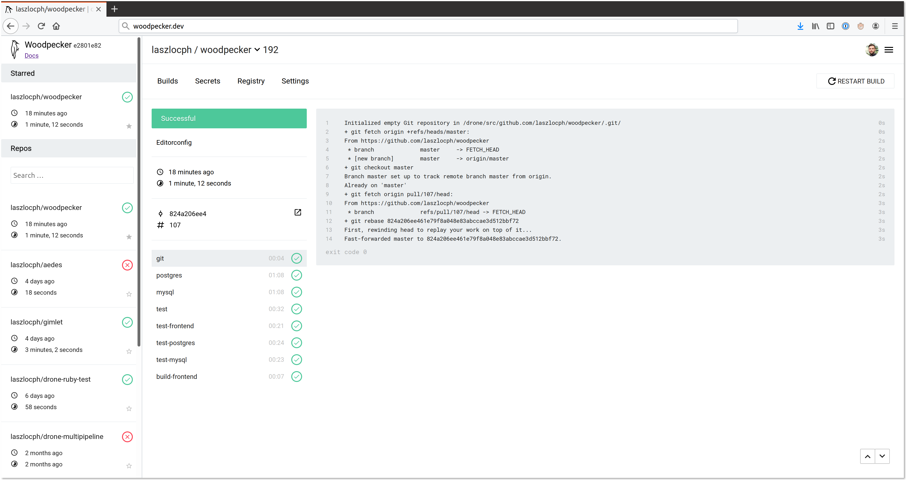

# Woodpecker

A fork of the Drone CI system.

- Based on the v0.8 code tree
- Fully Apache 2.0, no tiers

[](https://goreportcard.com/report/github.com/woodpecker-ci/woodpecker) [](https://opensource.org/licenses/Apache-2.0) [](https://discord.gg/fcMQqSMXJy)



## .drone.yml

- Place your pipeline in a file named `.drone.yml` in your repository
- Pipeline steps can be named as you like
- Run any command in the commands section

```yaml
# .drone.yml
pipeline:
  build:
    image: debian
    commands:
      - echo "This is the build step"
  a-test-step:
    image: debian
    commands:
      - echo "Testing.."
```

## Build steps are containers

- Define any Docker image as context
- Install the needed tools in custom Docker images, use them as context

```diff
 pipeline:
   build:
-    image: debian
+    image: mycompany/image-with-awscli
     commands:
       - aws help
```

## File changes are incremental

- Woodpecker clones the source code in the beginning pipeline
- Changes to files are persisted through steps as the same volume is mounted to all steps

```yaml
# .drone.yml
pipeline:
  build:
    image: debian
    commands:
      - touch myfile
  a-test-step:
    image: debian
    commands:
      - cat myfile
```

## Plugins are straighforward

- If you copy the same shell script from project to project
- Pack it into a plugin instead
- And make the yaml declarative
- Plugins are Docker images with your script as an entrypoint

```Dockerfile
# Dockerfile
FROM laszlocloud/kubectl
COPY deploy /usr/local/deploy
ENTRYPOINT ["/usr/local/deploy"]
```

```bash
# deploy
kubectl apply -f $PLUGIN_TEMPLATE
```

```yaml
# .drone.yml
pipeline:
  deploy-to-k8s:
    image: laszlocloud/my-k8s-plugin
    template: config/k8s/service.yml
```

## Documentation

https://woodpecker.laszlo.cloud

## Who uses Woodpecker

Currently, I know of one organization using this fork. With 50+ users, 130+ repos and more than 1100 builds a week.

Leave a note here if you are using it: https://github.com/woodpecker-ci/woodpecker/issues/122

## License

woodpecker is Apache 2.0 licensed with the source files in this repository having a header indicating which license they are under and what copyrights apply.

Files under the `docs/` folder is licensed under Creative Commons Attribution-ShareAlike 4.0 International Public License. It is a derivative work of the https://github.com/drone/docs git repository.
