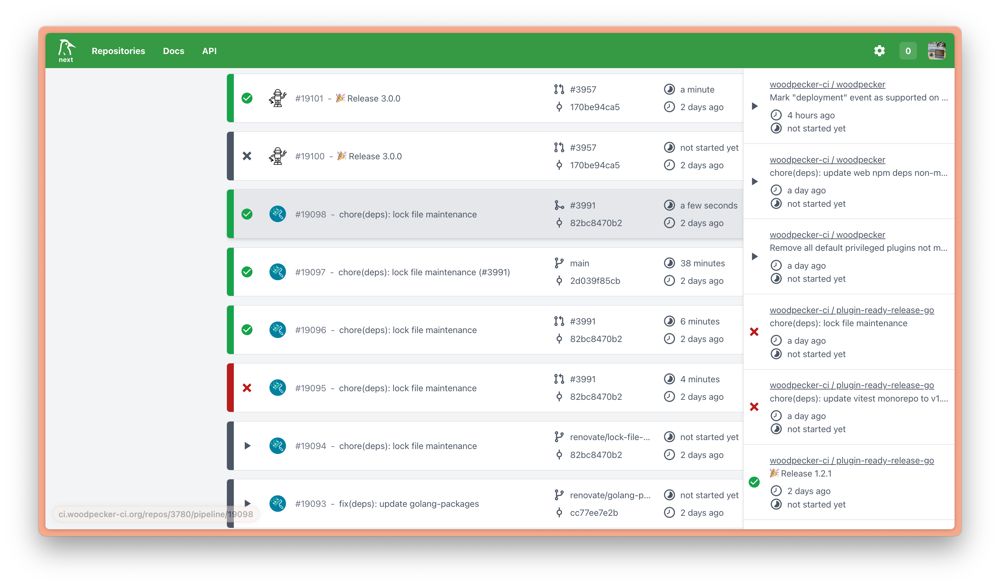

  

 

  
  
  
  
  
  
  
  
  
  
  
  

 

# Woodpecker

> Woodpecker is a community fork of the Drone CI system.

## 🫶 Support

Please consider to donate and become a backer. 🙏 [[Become a backer](https://opencollective.com/woodpecker-ci#category-CONTRIBUTE)]

## 📖 Documentation

https://woodpecker-ci.org/

## ✨ Contribute

See [Contributing Guide](CONTRIBUTING.md)

## 📣 Translate

We use an own [Weblate](https://weblate.org/en/) instance at [translate.woodpecker-ci.org](https://translate.woodpecker-ci.org).

## 👋 Who uses Woodpecker?

Woodpecker is used by [itself](https://ci.woodpecker-ci.org/woodpecker/woodpecker-ci/) multiple well-known companies, organizations like [Codeberg](https://codeberg.org), hobbyist and many others.

Leave a [comment](https://github.com/woodpecker-ci/woodpecker/discussions/2149) if you're using it as well.

Also consider using the topic `WoodpeckerCI` in your repository, so others can learn from your config and use the hashtag `#WoodpeckerCI` when talking about the project on social media!

Here are some places where people mention Woodpecker:

- [GitHub](https://github.com/topics/WoodpeckerCI)
- [Codeberg](https://codeberg.org/explore/repos?q=woodpeckerci&topic=1)
- [Twitter](https://twitter.com/search?q=%23WoodpeckerCI&src=typed_query)
- [Fediverse](https://mastodon.social/tags/WoodpeckerCI)

## ✨ Stars over time

## License

Woodpecker is Apache 2.0 licensed with the source files in this repository having a header indicating which license they are under and what copyrights apply.

Files under the `docs/` folder are licensed under Creative Commons Attribution-ShareAlike 4.0 International Public License.
