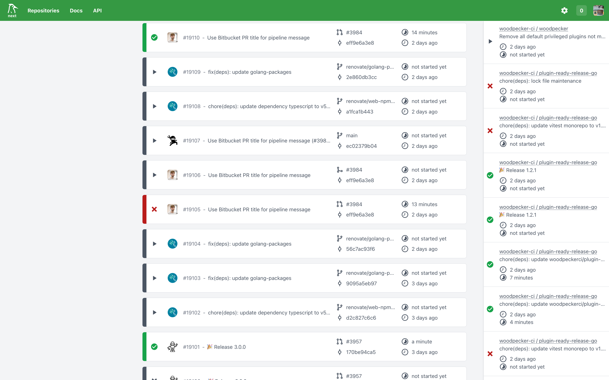

# Woodpecker

  

 

  
  
  
  
  
  
  
  
  
  
  

 

Woodpecker is a simple, yet powerful CI/CD engine with great extensibility.

## Installation & Resources

Woodpecker can be installed in various ways (see the [Installation Instructions](https://woodpecker-ci.org/docs/administration/getting-started)) and runs with SQLite as database by default.
It requires around 100 MB of RAM (Server) and 30 MB (Agent) at runtime in idle mode.

## Support

You can support the project by becoming a backer on [Open Collective](https://opencollective.com/woodpecker-ci#category-CONTRIBUTE) or via [GitHub Sponsors](https://github.com/sponsors/woodpecker-ci).

## Documentation

Our documentation can be found at <https://woodpecker-ci.org/docs/intro>.

## Translation

We have a self-hosted [Weblate](https://weblate.org/en/) instance at [translate.woodpecker-ci.org](https://translate.woodpecker-ci.org).

An overview of the current translation state is available at <https://translate.woodpecker-ci.org/projects/woodpecker-ci/#languages>.

## Public Woodpecker Instances

Woodpecker is used as the main CI/CD engine at [Codeberg](https://codeberg.org), an alternative Git hosting platform with a focus on privacy and free software development.

## Plugins

Woodpecker can be extended via plugins.
The [plugin overview website](https://woodpecker-ci.org/plugins) helps browsing available plugins.
It combines both plugins by the Woodpecker core team and community-maintained ones.

## Star History

## License

Woodpecker is Apache 2.0 licensed.
The source files have a header indicating which license they are under and what copyrights apply.

Everything in `docs/` is licensed under the Creative Commons Attribution-ShareAlike 4.0 International Public License.
