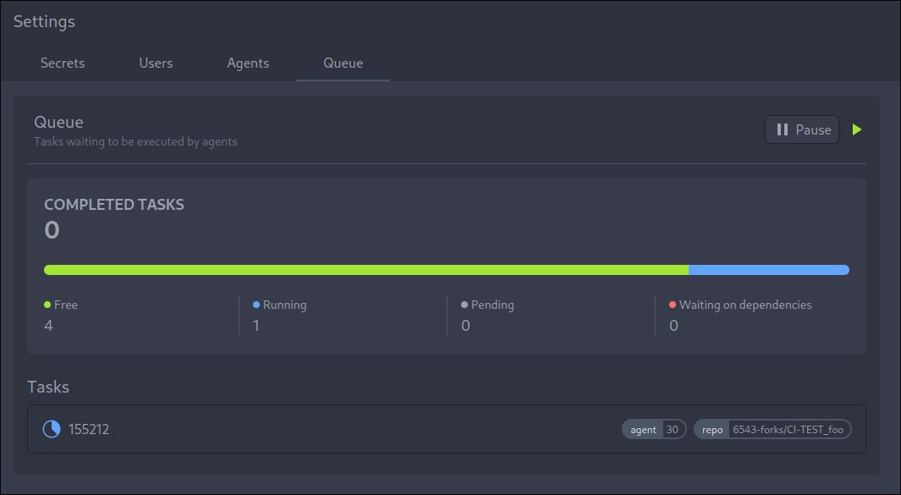
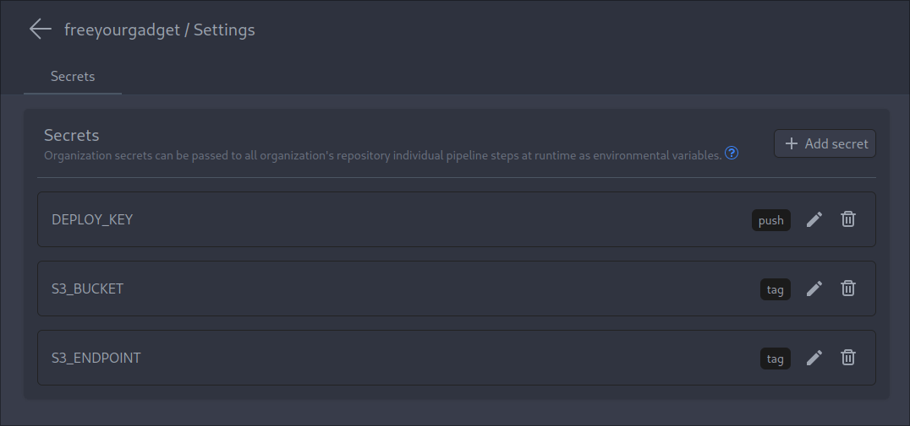

We are proud to present you Woodpecker v1.0.0.
It took us quite some time, but now we are sure it's ready, and you should really have a look at it.

<!--truncate-->

We've refactored a lot of code, so contributing to the codebase should be much easier.
Furthermore, a ton of bugs where addressed and various enhancements introduced, along with some highly anticipated features.
With Woodpecker v1.0.0, you can now substantially improve and streamline your code pipelines,
empowering you to automate and optimize workflows like never before.

## Some picked highlights

### Add Support for Cron Jobs

Automate recurring tasks with ease using Woodpecker's new cron jobs feature.
Schedule pipelines to run at specified intervals or times, optimizing repetitive workflows.
[Read more](/docs/1.0/usage/cron)

### YAML Map Merge, Overrides, and Sequence Merge Support

With enhanced YAML support, managing complex configurations becomes a breeze.
Merge maps, apply overrides, and sequence merging—all within your YAML files.
This is providing more flexibility and control over your pipelines.
[Read more](/docs/1.0/usage/advanced-yaml-syntax)

### Web-UI for Admins

Simplify administration tasks with Woodpecker's new Admin UI.
Effortlessly manage user accounts, agents, and tasks, including adding new agents or pausing the task queue for maintenance.

### Localize Web-UI

Embrace internationalization by changing your locale in the user settings.
Interact with Woodpecker in the language of your choice, tailored to your preferences.
If your language is not available or only partially translated, consider contributing to our [Weblate](https://translate.woodpecker-ci.org/engage/woodpecker-ci/).

### Add `evaluate` to `when` Filter

Enhance pipeline flexibility with the new "when evaluate" filter, enabling or disabling steps based on custom conditions.
Customize your workflows to dynamically respond to specific triggers and events.
[Read more](/docs/1.0/usage/pipeline-syntax#evaluate)

### Global- and Organization-Secrets

Save time and effort by declaring secrets for your entire instance or organization.
Simplify your workflow and securely manage sensitive information across projects.

## Changelog

The full changelog can be viewed in our project source folder at [CHANGELOG.md](https://github.com/woodpecker-ci/woodpecker/blob/v1.0.0/CHANGELOG.md)
