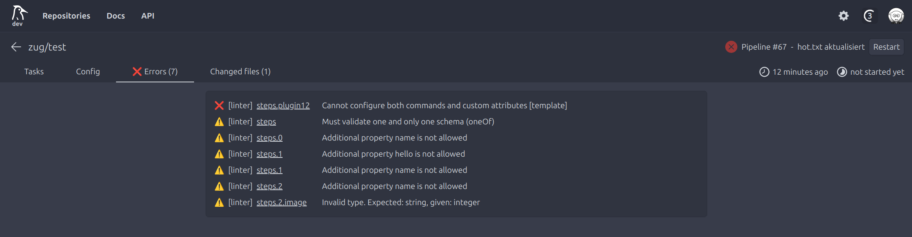
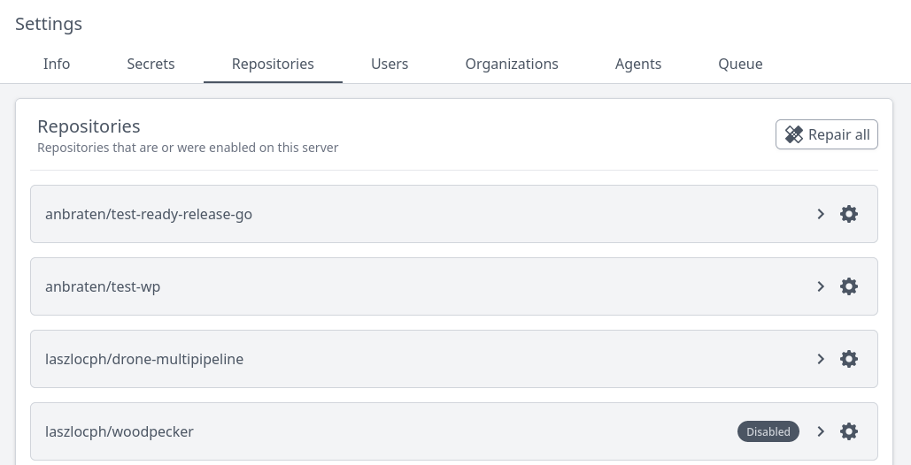

We are proud to present you Woodpecker v2.0.0 with more than 200 changes from our great community. This release includes a lot of new features, improvements and some breaking changes which most of you probably already tested using the `next` tag or the RC version.

<!--truncate-->

## Breaking changes

### Dropped deprecated environment variables and CLI commands

For 1.0.0, we deprecated a bunch of old environment variables like `CI_BUILD_*`. These variables were removed in this version, you must use the new ones.
Also, the deprecated `build` command of the CLI was removed. Use `pipeline` instead.

### Removed SSH backend

Due to various issues with the SSH backend we decided to remove it.
As an alternative, you can use an agent directly running on the SSH machine and connecting to the server on another computer.

### Deprecated `platform` filter

The `platform` filter has been removed. Use labels instead ([read more](./docs/usage/workflow-syntax#filter-by-platform)).

### Update Docker to v24

We updated Docker to v24. If you use an older version of Docker, it might not work anymore and you need to upgrade.

### Removed plugin-only option from secrets

There's no plugin-only option for secrets anymore. Instead, if you define an image filter, it will be only available to plugins.

## How we plan to handle releases in the future

In future, there won't be backports anymore. Instead, we'll release our current state of the `main` branch with the correct version (according to semver) every few weeks.
Of course, critical bug and security fixes are released immediatelly.

## Migration notes

There have been quite a few breaking changes. [Read more about what you need to do when upgrading!](./docs/migrations#200)

## New features

### Improved error and linter in the UI

Woodpecker now shows errors and linter warnings directly in it's UI, notifying you about missing secrets, incorrect configuration or unsupported YAML keys!

### Repository and organization overview for admins

Admins now get an overview over all repositories and organizations registered on the server, allowing them to perform common actions like deleting directly from the admin dashboard.

### Support for user secrets

It is possible to add secrets for all repos owned by yourself, similar to organization and global secrets.

### Bitbucket cloud support for multi-workflows

We enhanced support for Bitbucket, allowing you to use multiple workflows just as it's possible with the other forges already.

### Full support for Kubernetes backend

The Kubernetes backend now supports all features.

### Auto theme

The UI now supports automatically adapting the theme to your browser config.

### Update notification

Admins now get a notification in the UI if there's an update for Woodpecker available.

## Changelog

The full changelog can be viewed in our project source folder at [CHANGELOG.md](https://github.com/woodpecker-ci/woodpecker/blob/v2.0.0/CHANGELOG.md)
