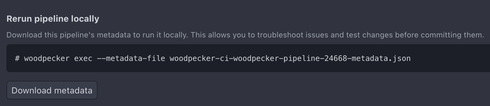
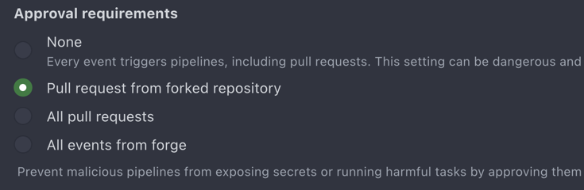

We are excited to announce the release of Woodpecker 3.0.0! Along with various cleanup improvements, you can now register your own agents as a user and replay pipelines directly from the server using cli exec.

<!--truncate-->

## Breaking Changes

To enhance the usability of Woodpecker and comply with evolving security standards, we periodically implement migrations. While we strive to minimize changes, some adjustments are essential for an improved user experience.
We acknowledge that this release includes a significant number of changes, many of which require users to update their pipeline definitions. We understand that this can be a tedious task, especially when managing multiple repositories and pipelines.
Rest assured that each modification was carefully considered and thoroughly discussed, with specific reasoning behind every decision.

A substantial portion of these updates aims to transition away from outdated and suboptimal Drone definitions. Your patience and understanding as we implement these necessary changes are greatly appreciated. If you encounter any major issues during your migration to a new version, please don't hesitate to reach out. The Woodpecker maintainers are always eager to reassess and improve our updates based on your feedback.

Security has been a primary focus in this major release. In addition to patching known vulnerabilities (which have also been backported to v2 releases), we have enhanced the secrets handling mechanism to prevent accidental leaks and simplify the process of keeping sensitive information fully encrypted.

For a complete list of migration steps, please refer to the [migration guide](/migrations).

### `from_secret:` as the powerful replacement for the `secrets:` keyword

Specifically, the `secrets:` keyword has been deprecated in favor of a more flexible (and secure) way to specify secrets: `from_secret:`.
This new approach provides more flexibility (by using different names for the source and destination secrets) and ensures a safe internal secret parsing through a unified engine.
Because secrets defined via `secrets:` were simple env vars in the end, this change also removes potential confusion about the differences between values specified in `environment:` and `secrets`.
Now, both are defined in `environment:` using an expressive syntax:

```yaml
steps:
  name:
    image: alpine
    commands:
      - echo "The secret is $TOKEN_ENV"
    environment:
      TOKEN_ENV:
        from_secret: SECRET_TOKEN
```

## Register Your Own Agents for Users or Organizations [#3539](https://github.com/woodpecker-ci/woodpecker/pull/3539)

WoodpeckerCI now lets you register custom agents scoped to individual users or organizations. This means you can bring your own agents, configured to meet the unique needs of your projects, and assign them to specific users or organizational workflows.

This update provides flexibility for teams with diverse requirements, allowing them to integrate agents tailored to specific tasks or environments seamlessly into their pipelines.

## Replay Pipelines Locally Using `cli exec` [#4103](https://github.com/woodpecker-ci/woodpecker/pull/4103)

Debugging pipelines no longer requires endless small adjustments and repeated pushes. With the new `woodpecker-cli exec` feature, you can download pipeline metadata directly from the server and replay it locally. This allows you to test and fix issues in a similar environment to the server, all from your machine.



By locally debugging, this feature accelerates the development process and provides deeper insights into pipeline behavior without relying on server-side execution for every small change.

:::info
In order to use this feature, all required pipeline elements must be passed, e.g. secrets.
However, secrets are not included in the pipeline metadata and must be passed manually to the local execution call.
:::

## Rootless images

Woodpecker now supports running rootless images by adjusting the entrypoints and directory permissions in the containers in a way that allows non-privileged users to execute tasks.

In addition, all images published by Woodpecker (Server, Agent, CLI) now use a non-privileged user (`woodpecker` with UID and GID `1000`) by default. If you have volumes attached to the containers, you may need to change the ownership of these directories from `root` to `woodpecker` by executing `chown -R 1000:1000 <mount dir>`.

:::info
The agent image must remain rootful by default to be able to mount the Docker socket when Woodpecker is used with the `docker` backend.
The helm chart will start to use a non-privileged user by utilizing `securityContext`.
Running a completely rootless agent with the `docker` backend may be possible by using a rootless docker daemon.
However, this requires more work and is currently not supported.
:::

## Fine grained control over approvals options

Woodpecker 3.0.0 introduces enhanced approval options. Beyond requiring approval for all pipeline events, you can now configure it specifically for all pull requests or only for pull requests originating from forks.

By default, public repositories will now mandate approval for pull requests from forks. This helps prevent potentially malicious PRs from exposing secrets or performing unauthorized actions without the repository owner's awareness.



## UI

We have fixed many UI-related bugs in this version.
Many were small misalignment related to padding, margins or other edge cases related to small screen sizes.
We also aimed to harmonize the icons across the UI, specifically across logical subgroups, such as status-icons or admin panel icons.

UI elements are now sized in a relative way, meaning they will all scale relative when you change the font-size or zoom in/out.

## Deleting old pipeline logs

Deleting a pipeline now successfully also deletes its related logs.
Beforehand, there was an issue where the logs were not deleted and were kept in the DB forever.

You might want to check [#4572](https://github.com/woodpecker-ci/woodpecker/pull/4572) for more details including a snippet how to delete orphaned entries of a Postgres DB.

:::info
There is no option yet to auto-delete old pipeline logs after a specific time or event.
Please follow [#1068](https://github.com/woodpecker-ci/woodpecker/issues/1068) for future updates.
:::

## Migration to standard Linux CRON syntax

CRON definitions now follow standard Linux syntax without seconds. An automatic migration will attempt to update your settings - ensure the update completes successfully.

## Known Issues

The generic `pipeline definition not found` is still present and not yet understood.
This error message can be triggered by various elements (which the most likely one being a (temporary) connection issue with the forge) and the error return/output must be improved first in order to take appropriate action.
