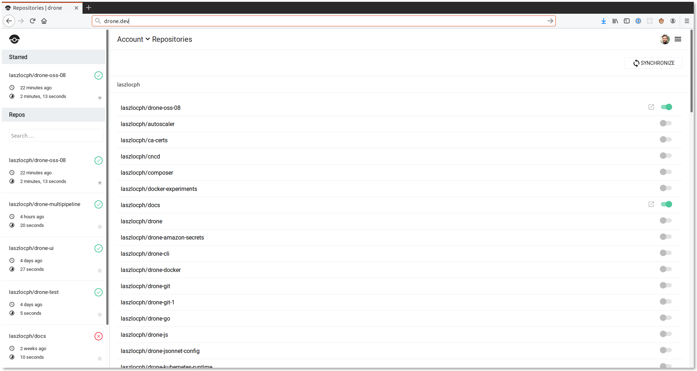

# Getting started

## Repository Activation

To activate your project navigate to your account settings. You will see a list of repositories which can be activated with a simple toggle. When you activate your repository, Woodpecker automatically adds webhooks to your forge (e.g. GitHub, Gitea, ...).

Webhooks are used to trigger pipeline executions. When you push code to your repository, open a pull request, or create a tag, your forge will automatically send a webhook to Woodpecker which will in turn trigger the pipeline execution.



## Required Permissions

The user who enables a repo in Woodpecker must have `Admin` rights on that repo, so that Woodpecker can add the webhook.

:::note
Note that manually creating webhooks yourself is not possible.
This is because webhooks are signed using a per-repository secret key which is not exposed to end users.
:::

## Configuration

To configure your pipeline you must create a `.woodpecker.yaml` file in the root of your repository. The `.woodpecker.yaml` file is used to define your pipeline steps.

:::note
We support most of YAML 1.2, but preserve some behavior from 1.1 for backward compatibility.
Read more at: [https://github.com/go-yaml/yaml](https://github.com/go-yaml/yaml/tree/v3)
:::

Example pipeline configuration:

```yaml
steps:
  - name: build
    image: golang
    commands:
      - go get
      - go build
      - go test

services:
  - name: postgres
    image: postgres:9.4.5
    environment:
      - POSTGRES_USER=myapp
```

Example pipeline configuration with multiple, serial steps:

```yaml
steps:
  - name: backend
    image: golang
    commands:
      - go get
      - go build
      - go test

  - name: frontend
    image: node:6
    commands:
      - npm install
      - npm test

  - name: notify
    image: plugins/slack
    settings:
      channel: developers
      username: woodpecker
```

## Execution

To trigger your first pipeline execution you can push code to your repository, open a pull request, or push a tag. Any of these events triggers a webhook from your forge and execute your pipeline.
