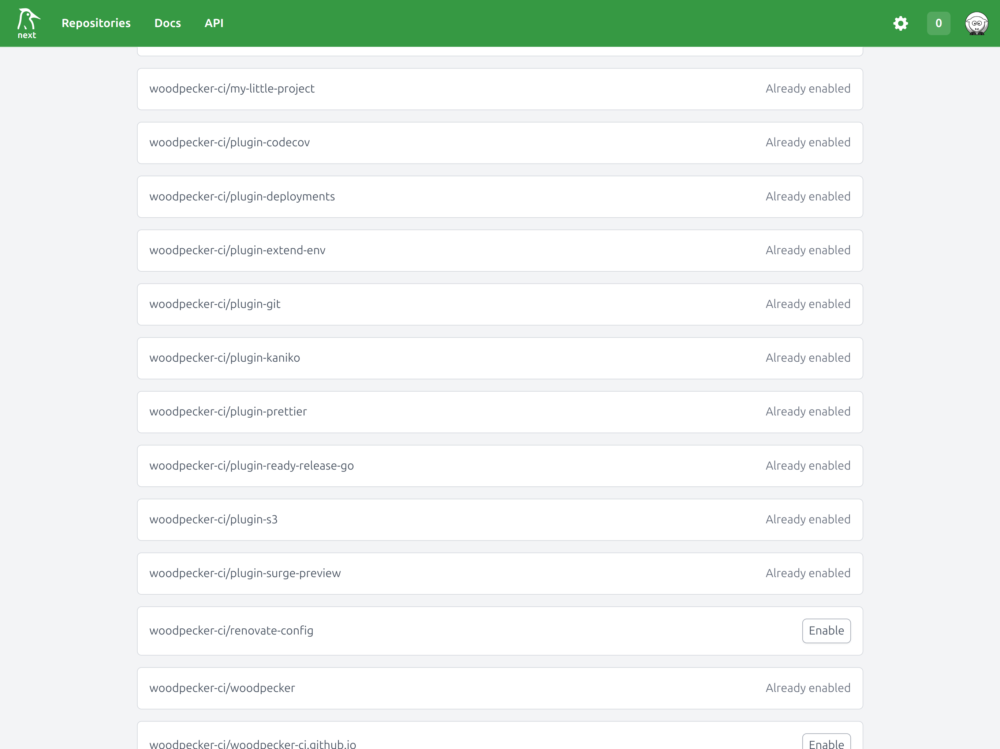
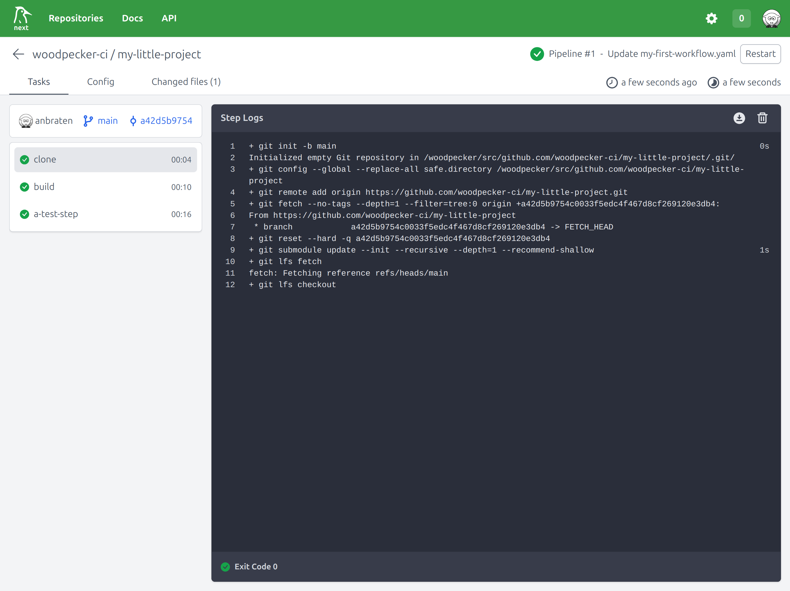

# "Hello world" pipeline

Let's get started and create a simple pipeline to demonstrate the pipeline syntax and overall behavior.

## 1. Repository Activation

To enable your repository in Woodpecker, navigate to the repository list and select **New Repository**.
You’ll be presented with a list of repositories from your forge (e.g., GitHub, GitLab) that can be activated with a simple click.
Ensure you have administrative rights on the repository in your forge, as Woodpecker needs to add a webhook to detect events like pushes, pull requests, and tags. 



## 2. The first workflow

Once your repository is enabled, Woodpecker starts monitoring it for changes.
When a change is detected, it looks for a pipeline configuration file.
To set up your first workflow, create a file named `.woodpecker/my-first-workflow.yaml` (feel free to change the file name to your liking) in your repository:

```yaml title=".woodpecker/my-first-workflow.yaml"
when:
  - event: push
    branch: main

steps:
  - name: build
    image: debian:latest
    commands:
      - echo "This is the build step"
      - echo "binary-data-123" > executable
  - name: test
    image: golang:latest
    commands:
      - echo "Testing ..."
      - ./executable
```

**So what did we do here?**

1. This workflow will be executed when a `push` event happens on the `main` branch,
   because we added a filter using the `when` section:

   ```diff
   + when:
   +   - event: push
   +     branch: main

   ...
   ```

1. We defined two steps: `build` and `test`

The steps in your workflow are executed sequentially in the order they are defined.
For instance, the `build` step will run first, followed by the `test` step.

- In the `build` step, the workflow uses the debian image to create a binary file named executable.
- In the `test` step, the workflow uses the `golang:latest` image to run the executable file for testing.

You can use any image any registry you have access to.
The most common one is [Docker Hub](https://hub.docker.com/search?type=image).
By default, `docker.io` (=Dockerhub) is used implicitly as the default registry.
If you want to use a different one, you need to prefix the registry explicitly:

```diff
 steps:
   - name: build
-    image: debian
+    image: my-registry/my-company/my-image:latest
```

## 3. Push the file and trigger the first pipeline

If you commit and push this file to your repository, Woodpecker will execute the pipeline.

You can check the pipeline execution in the Woodpecker UI by navigating to the `Pipelines` section of your repository.



As you probably noticed, there is another step called `clone` which is executed before your steps.
This step is required to initially clone your repository into a directory named `workspace`.
This directory will be available throughout all steps and provide the pipeline access to the files.
As this is always required to get started, Woodpecker adds this step implicitly.
There are ways to [alter/omit this step](./20-workflow-syntax.md#clone) for specific use cases, but this is out-of-scope for getting started.

## 4. Use a plugin for reusable tasks

Woodpecker plugins are steps that aim to simplify the execution of frequently used tasks.
They also come with restricted modification functionality, which reduces the potential attack surface, for example by disallowing the use of arbitrary environment variables.
The Woodpecker team maintains a set of official plugins.
In addition, there are many community plugins available from various contributors.
Most can be found in the [Plugin registry](https://woodpecker-ci.org/plugins), but you will surely also find additional ones out in the wild.

If you want to create your own plugin, take a look at our [plugin guide](./51-plugins/20-creating-plugins.md).

The key differences between plugins and regular steps in Woodpecker are:

- No `environment:` section: Plugins do not support the use of the `environment:` section for defining environment variables.
- Dedicated `settings:` section: Plugins utilize a specific `settings:` section to configure their options and behavior.

```yaml
steps:
  - name: Upload to S3
    image: woodpeckerci/plugin-s3:latest
    settings:
      bucket: my-bucket-name
      access_key: my-access-key
      secret_key:
        from_secret: secret_key
```
