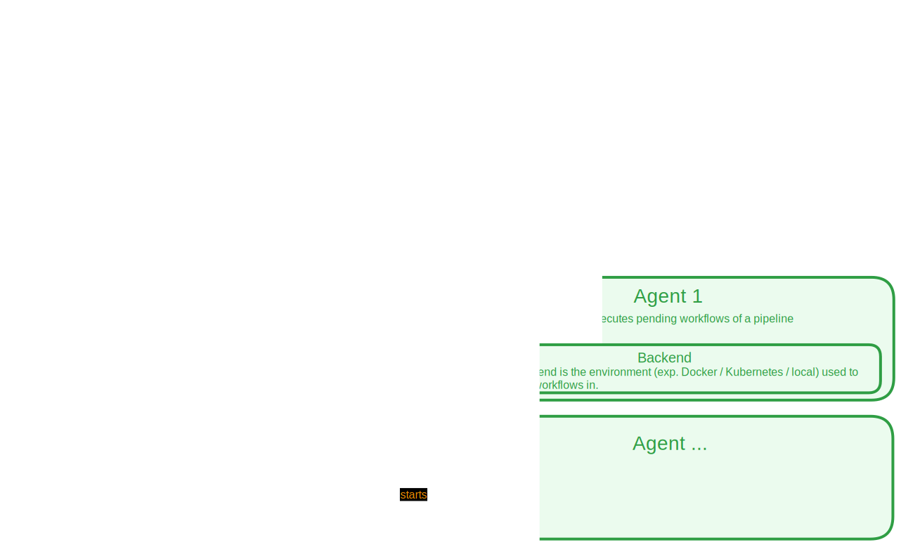
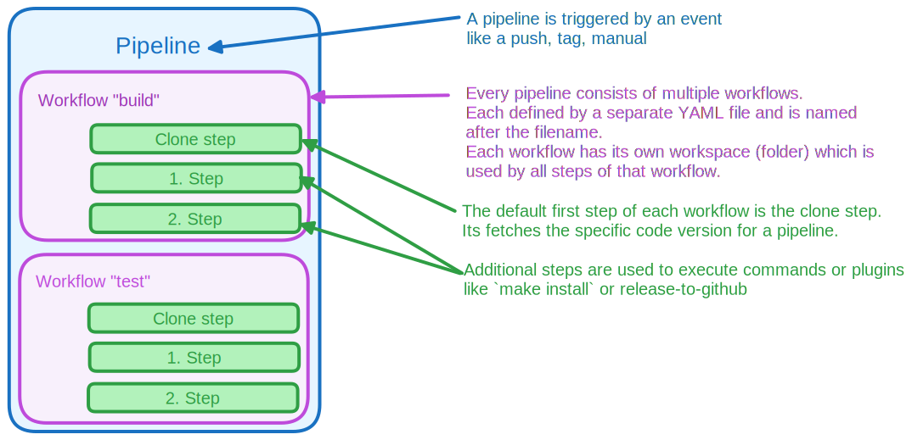

# Terminology

## Glossary

- **Woodpecker CI**: The project name around Woodpecker.
- **Woodpecker**: An open-source tool that executes [pipelines][Pipeline] on your code.
- **Server**: The component of Woodpecker that handles webhooks from forges, orchestrates agents, and sends status back. It also serves the API and web UI for administration and configuration.
- **Agent**: A component of Woodpecker that executes [pipelines][Pipeline] (specifically one or more [workflows][Workflow]) with a specific backend (e.g. [Docker][], Kubernetes, [local][Local]). It connects to the server via GRPC.
- **CLI**: The Woodpecker command-line interface (CLI) is a terminal tool used to administer the server, to execute pipelines locally for debugging / testing purposes, and to perform tasks like linting pipelines.
- **[Pipeline][Pipeline]**: A sequence of [workflows][Workflow] that are executed on the code. Pipelines are triggered by events.
- **[Workflow][Workflow]**: A sequence of steps and services that are executed as part of a [pipeline][Pipeline]. Workflows are represented by YAML files. Each workflow has its own isolated [workspace][Workspace], and often additional resources like a shared network (docker).
- **Steps**: Individual commands, actions or tasks within a [workflow][Workflow].
- **Code**: Refers to the files tracked by the version control system used by the [forge][Forge].
- **Repos**: Short for repositories, these are storage locations where code is stored.
- **[Forge][Forge]**: The hosting platform or service where the repositories are hosted.
- **[Workspace][workspace]**: A folder shared between all steps of a [workflow][Workflow] containing the repository and all the generated data from previous steps.
- **[Event][Event]**: Triggers the execution of a [pipeline][Pipeline], such as a [forge][Forge] event like `push`, or `manual` triggered manually from the UI.
- **Commit**: A defined state of the code, usually associated with a version control system like Git.
- **[Matrix][Matrix]**: A configuration option that allows the execution of [workflows][Workflow] for each value in the matrix.
- **Service**: A service is a step that is executed from the start of a [workflow][Workflow] until its end. It can be accessed by name via the network from other steps within the same [workflow][Workflow].
- **[Plugins][Plugin]**: Plugins are extensions that provide pre-defined actions or commands for a step in a [workflow][Workflow]. They can be configured via settings.
- **Container**: A lightweight and isolated environment where commands are executed.
- **YAML File**: A file format used to define and configure [workflows][Workflow].
- **Dependency**: [Workflows][Workflow] can depend on each other, and if possible, they are executed in parallel.
- **Status**: Status refers to the outcome of a step or [workflow][Workflow] after it has been executed, determined by the internal command exit code. At the end of a [workflow][Workflow], its status is sent to the [forge][Forge].
- **Service extension**: Some parts of Woodpecker internal services like secrets storage or config fetcher can be replaced through service extensions.

## Woodpecker architecture

## Pipeline, workflow & step

## Conventions

Sometimes there are multiple terms that can be used to describe something. This section lists the preferred terms to use in Woodpecker:

- Environment variables `*_LINK` should be called `*_URL`. In the code use `URL()` instead of `Link()`
- Use the term **pipelines** instead of the previous **builds**
- Use the term **steps** instead of the previous **jobs**
- Use the prefix `WOODPECKER_EXPERT_` for advanced environment variables that are normally not required to be set by users

<!-- References -->

[Event]: ../20-workflow-syntax.md#event
[Pipeline]: ../20-workflow-syntax.md
[Workflow]: ../25-workflows.md
[Forge]: ../../30-administration/11-forges/11-overview.md
[Plugin]: ../51-plugins/51-overview.md
[Workspace]: ../20-workflow-syntax.md#workspace
[Matrix]: ../30-matrix-workflows.md
[Docker]: ../../30-administration/22-backends/10-docker.md
[Local]: ../../30-administration/22-backends/20-local.md
