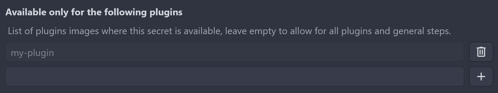

# Secrets

Woodpecker provides the ability to store named parameters external to the YAML configuration file, in a central secret store. These secrets can be passed to individual steps of the pipeline at runtime.

Woodpecker provides three different levels to add secrets to your pipeline. The following list shows the priority of the different levels. If a secret is defined in multiple levels, will be used following this priorities: Repository secrets > Organization secrets > Global secrets.

1. **Repository secrets**: They are available to all pipelines of an repository.
2. **Organization secrets**: They are available to all pipelines of an organization.
3. **Global secrets**: Can be configured by an instance admin.
   They are available to all pipelines of the **whole** Woodpecker instance and should therefore **only** be used for secrets that are allowed to be read by **all** users.

## Usage

### Use secrets in commands

Secrets are exposed to your pipeline steps and plugins as uppercase environment variables and can therefore be referenced in the commands section of your pipeline,
once their usage is declared in the `secrets` section:

```diff
 steps:
   - name: docker
     image: docker
     commands:
+      - echo $docker_username
+      - echo $DOCKER_PASSWORD
+    secrets: [ docker_username, DOCKER_PASSWORD ]
```

The case of the environment variables is not changed, but secret matching is done case-insensitively. In the example above, `DOCKER_PASSWORD` would also match if the secret is called `docker_password`.

### Use secrets in settings and environment

You can set an setting or environment value from secrets using the `from_secret` syntax.

In this example, the secret named `secret_token` would be passed to the setting named `token`,which will be available in the plugin as environment variable named `PLUGIN_TOKEN` (See [plugins](./51-plugins/20-creating-plugins.md#settings) for details), and to the environment variable `TOKEN_ENV`.

```diff
 steps:
   - name: docker
     image: my-plugin
+    environment:
+      TOKEN_ENV:
+        from_secret: secret_token
+    settings:
+      token:
+        from_secret: secret_token
```

### Note about parameter pre-processing

Please note parameter expressions are subject to pre-processing. When using secrets in parameter expressions they should be escaped.

```diff
 steps:
   - name: docker
     image: docker
     commands:
-      - echo ${docker_username}
-      - echo ${DOCKER_PASSWORD}
+      - echo $${docker_username}
+      - echo $${DOCKER_PASSWORD}
     secrets: [ docker_username, DOCKER_PASSWORD ]
```

### Use in Pull Requests events

Secrets are not exposed to pull requests by default. You can override this behavior by creating the secret and enabling the `pull_request` event type, either in UI or by CLI, see below.

:::note
Please be careful when exposing secrets to pull requests. If your repository is open source and accepts pull requests your secrets are not safe. A bad actor can submit a malicious pull request that exposes your secrets.
:::

## Plugins filter

To prevent abusing your secrets from malicious usage, you can limit a secret to a list of plugins. If enabled they are not available to any other plugin (steps without user-defined commands). If you or an attacker defines explicit commands, the secrets will not be available to the container to prevent leaking them.

:::note
If you specify a tag, the filter will respect it.
Just make sure you don't specify the same image without one, otherwise it will be ignored again.
:::



## Adding Secrets

Secrets are added to the Woodpecker in the UI or with the CLI.

### CLI Examples

Create the secret using default settings. The secret will be available to all images in your pipeline, and will be available to all push, tag, and deployment events (not pull request events).

```bash
woodpecker-cli secret add \
  -repository octocat/hello-world \
  -name aws_access_key_id \
  -value <value>
```

Create the secret and limit to a single image:

```diff
 woodpecker-cli secret add \
   -repository octocat/hello-world \
+  -image plugins/s3 \
   -name aws_access_key_id \
   -value <value>
```

Create the secrets and limit to a set of images:

```diff
 woodpecker-cli secret add \
   -repository octocat/hello-world \
+  -image plugins/s3 \
+  -image woodpeckerci/plugin-ecs \
   -name aws_access_key_id \
   -value <value>
```

Create the secret and enable for multiple hook events:

```diff
 woodpecker-cli secret add \
   -repository octocat/hello-world \
   -image plugins/s3 \
+  -event pull_request \
+  -event push \
+  -event tag \
   -name aws_access_key_id \
   -value <value>
```

Loading secrets from file using curl `@` syntax. This is the recommended approach for loading secrets from file to preserve newlines:

```diff
 woodpecker-cli secret add \
   -repository octocat/hello-world \
   -name ssh_key \
+  -value @/root/ssh/id_rsa
```
