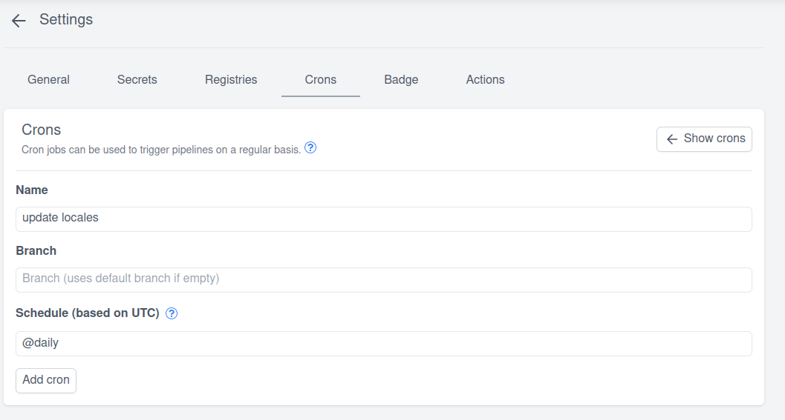

# Cron

To configure cron jobs you need at least push access to the repository.

:::warning
By default pipelines triggered by cron jobs wont execute any steps in pipelines, as they are not part of the default event filter and you explicitly need to set a `event: cron` filter.
Read more at: [pipeline-syntax#event](./20-pipeline-syntax.md#event)
:::

## Add a new cron job

1. To create a new cron job adjust your pipeline config(s) and add the event filter to all steps you would like to run by the cron job:

    ```diff
     pipeline:
       sync_locales:
         image: weblate_sync
         settings:
           url: example.com
           token:
             from_secret: weblate_token
    +    when:
    +      event: cron
    +      cron: "name of the cron job" # if you only want to execute this step by a specific cron job
    ```

1. Create a new cron job in the repository settings:

    

    The supported schedule syntax can be found at <https://pkg.go.dev/github.com/robfig/cron?utm_source=godoc#hdr-CRON_Expression_Format>. If you need general understanding of the cron syntax <https://crontab.guru/> is a good place to start and experiment.

    Examples: `@every 5m`, `@daily`, `0 30 * * * *` ...

    :::info
    Woodpeckers cron syntax starts with seconds instead of minutes as used by most linux cron schedulers.

    Example: "At minute 30 every hour" would be `0 30 * * * *` instead of `30 * * * *`
    :::
