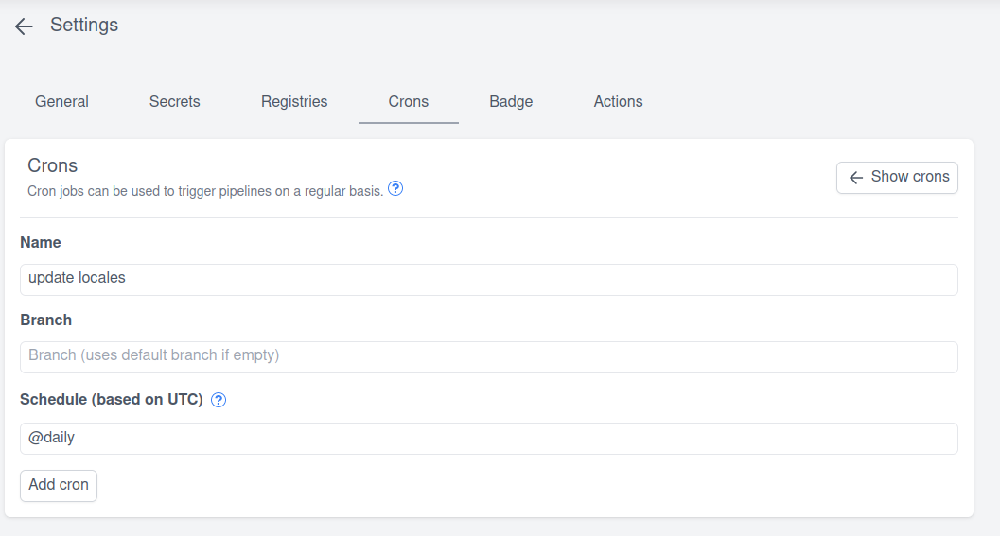

# Cron

To configure cron jobs you need at least push access to the repository.

## Add a new cron job

1. To create a new cron job adjust your pipeline config(s) and add the event filter to all steps you would like to run by the cron job:

   ```diff
    steps:
      - name: sync_locales
        image: weblate_sync
        settings:
          url: example.com
          token:
            from_secret: weblate_token
   +    when:
   +      event: cron
   +      cron: "name of the cron job" # if you only want to execute this step by a specific cron job
   ```

2. Create a new cron job in the repository settings:

   

   The supported schedule syntax can be found at <https://pkg.go.dev/github.com/gdgvda/cron#hdr-CRON_Expression_Format>. If you need general understanding of the cron syntax <https://it-tools.tech/crontab-generator> is a good place to start and experiment.

   Examples: `@every 5m`, `@daily`, `30 * * * *` ...

## Running only some workflows

By default a cron job runs every workflow that matches the `cron` event. A cron job can instead be limited to a subset of the repository's workflows, which is set next to the schedule in the repository settings, or with the `--workflow` flag of the CLI.

See [running only some workflows](./25-workflows.md#running-only-some-workflows).
