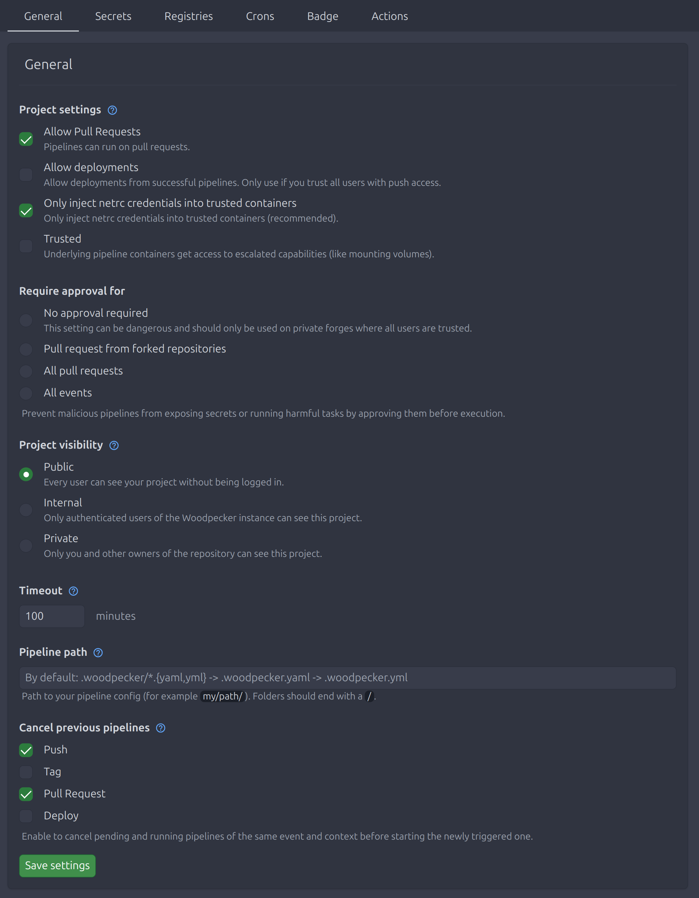

# Project settings

As the owner of a project in Woodpecker you can change project related settings via the web interface.

## Pipeline path

The path to the pipeline config file or folder.
By default it is left empty which will use the following configuration resolution `.woodpecker/*.yml` -> `.woodpecker/*.yaml` -> `.woodpecker.yml` -> `.woodpecker.yaml`.
If you set a custom path Woodpecker tries to load your configuration or fails if no configuration could be found at the specified location.
To use a [multiple workflows](./25-workflows.md) with a custom path you have to change it to a folder path ending with a `/` like `.woodpecker/`.

## Repository hooks

Your Version-Control-System will notify Woodpecker about events via webhooks.
If you want your pipeline to only run on specific webhooks, you can check them with this setting.

## Project settings

### Allow pull requests

Enables handling webhook's pull request event.
If disabled, then pipeline won't run for pull requests.

### Protected

Every pipeline initiated by an webhook event needs to be approved by a project members with push permissions before being executed.
The protected option can be used as an additional review process before running potentially harmful pipelines.
Especially if pipelines can be executed by third-parties through pull-requests.

### Trusted

If you set your project to trusted, a pipeline step and by this the underlying containers gets access to escalated capabilities like mounting volumes.

:::note

Only server admins can set this option.
If you are not a server admin this option won't be shown in your project settings.

:::

### Only inject netrc credentials into trusted containers

Cloning pipeline step may need git credentials.
They are injected via netrc.
By default, they're only injected if this option is enabled, the repo is trusted ([see above](#trusted)) or the image is a trusted clone image.
If you uncheck the option, git credentials will be injected into any container in clone step.

## Project visibility

You can change the visibility of your project by this setting.
If a user has access to a project he can see all builds and their logs and artifacts.
Settings, Secrets and Registries can only be accessed by owners.

- `Public` Every user can see your project without being logged in.
- `Internal` Only authenticated users of the Woodpecker instance can see this project.
- `Private` Only you and other owners of the repository can see this project.

## Timeout

After this timeout a pipeline has to finish or will be treated as timed out.

## Cancel previous pipelines

By enabling this option for a pipeline event previous pipelines of the same event and context will be canceled before starting the newly triggered one.
