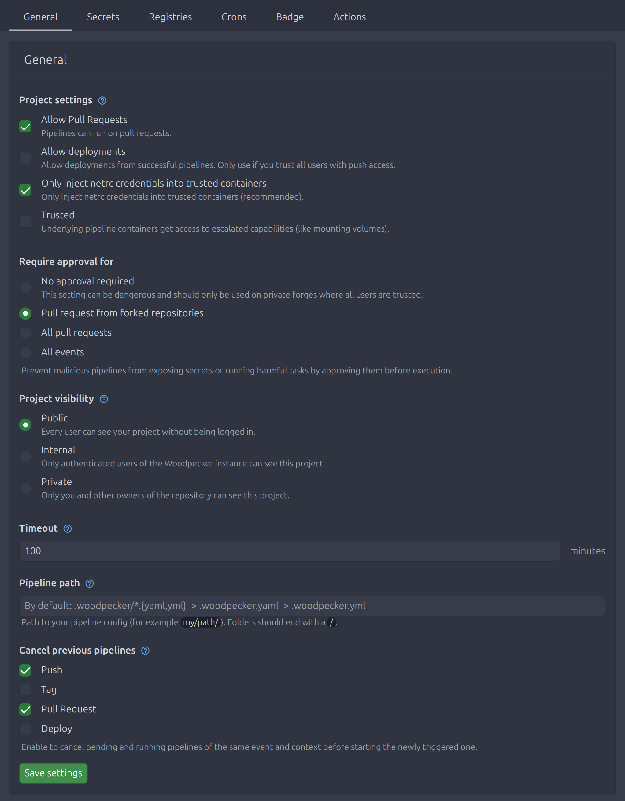

# Project settings

As the owner of a project in Woodpecker you can change project related settings via the web interface.

## Pipeline path

The path to the pipeline config file or folder. By default it is left empty which will use the following configuration resolution `.woodpecker/*.yml` and `.woodpecker/*.yaml` (without any preference in handling them) -> `.woodpecker.yml` -> `.woodpecker.yaml` -> `.drone.yml`. If you set a custom path Woodpecker tries to load your configuration or fails if no configuration could be found at the specified location. To use a [multi pipeline](./25-multi-pipeline.md) you have to change it to a folder path ending with a `/` like `.woodpecker/`.

## Repository hooks

Your Version-Control-System will notify Woodpecker about events via webhooks. If you want your pipeline to only run on specific webhooks, you can check them with this setting.

## Project settings

### Protected

Every build initiated by a user (not including the project owner) needs to be approved by the owner before being executed. This can be used if your repository is public to protect the pipeline configuration from running unauthorized changes on third-party pull requests.

### Trusted

If you set your project to trusted, a pipeline step and by this the underlying containers gets access to escalated capabilities like mounting volumes.

:::note

Only server admins can set this option. If you are not a server admin this option won't be shown in your project settings.

:::

## Project visibility

You can change the visibility of your project by this setting. If a user has access to a project he can see all builds and their logs and artifacts. Settings, Secrets and Registries can only be accessed by owners.

- `Public` Every user can see your project without being logged in.
- `Private` Only authenticated users of the Woodpecker instance can see this project.
- `Internal` Only you and other owners of the repository can see this project.

## Timeout

After this timeout a pipeline has to finish or will be treated as timed out.

## Cancel previous pipelines

By enabling this option for a pipeline event previous pipelines of the same event and context will be canceled before starting the newly triggered one.
