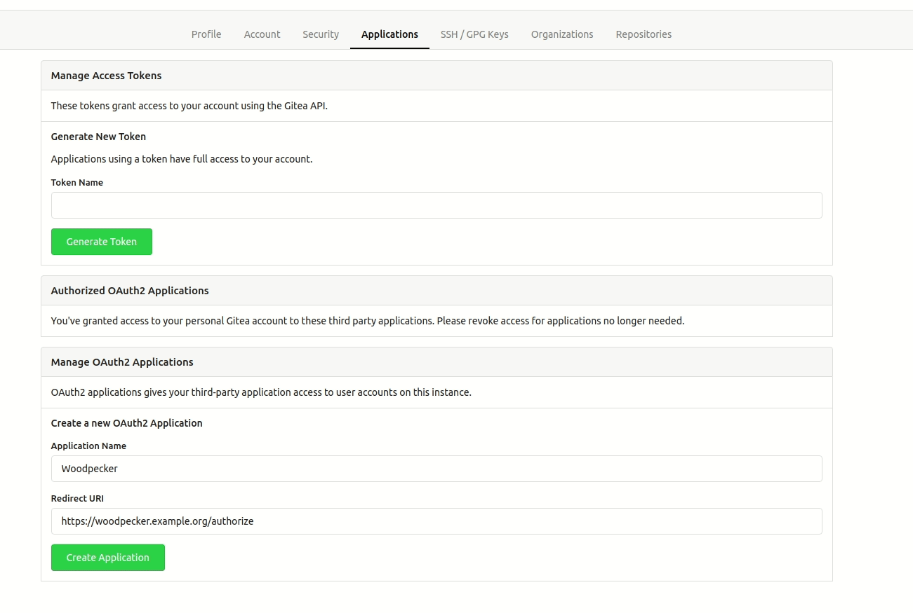

# Forgejo

Woodpecker comes with built-in support for Forgejo. To enable Forgejo you should configure the Woodpecker container using the following environment variables:

```ini
WOODPECKER_FORGEJO=true
WOODPECKER_FORGEJO_URL=YOUR_FORGEJO_URL
WOODPECKER_FORGEJO_CLIENT=YOUR_FORGEJO_CLIENT
WOODPECKER_FORGEJO_SECRET=YOUR_FORGEJO_CLIENT_SECRET
```

## Forgejo on the same host with containers

If you have Forgejo also running on the same host within a container, make sure the agent does have access to it.
The agent tries to clone using the URL which Forgejo reports through its API. For simplified connectivity, you should add the Woodpecker agent to the same docker network as Forgejo is in.
Otherwise, the communication should go via the `docker0` gateway (usually 172.17.0.1).

To configure the Docker network if the network's name is `forgejo`, configure it like this:

```diff title="docker-compose.yaml"
 services:
   [...]
   woodpecker-agent:
     [...]
     environment:
       - [...]
+      - WOODPECKER_BACKEND_DOCKER_NETWORK=forgejo
```

## Registration

Register your application with Forgejo to create your client id and secret. You can find the OAuth applications settings of Forgejo at `https://forgejo.<host>/user/settings/`. It is very important that authorization callback URL matches your http(s) scheme and hostname exactly with `https://<host>/authorize` as the path.

If you run the Woodpecker CI server on the same host as the Forgejo instance, you might also need to allow local connections in Forgejo. Otherwise webhooks will fail. Add the following lines to your Forgejo configuration (usually at `/etc/forgejo/conf/app.ini`).

```ini
[webhook]
ALLOWED_HOST_LIST=external,loopback
```

For reference see [Configuration Cheat Sheet](https://forgejo.org/docs/latest/admin/config-cheat-sheet/#webhook-webhook).



:::warning
Make sure your Forgejo configuration allows requesting the API with a fixed page length of 50. The default value for the maximum page size is 50, but if you set a value lower than 50, some Woodpecker features will not work properly. Also see the [Configuration Cheat Sheet](https://forgejo.org/docs/latest/admin/config-cheat-sheet/#api-api).
:::

## Configuration

This is a full list of configuration options. Please note that many of these options use default configuration values that should work for the majority of installations.

---

### FORGEJO

- Name: `WOODPECKER_FORGEJO`
- Default: `false`

Enables the Forgejo driver.

---

### FORGEJO_URL

- Name: `WOODPECKER_FORGEJO_URL`
- Default: `https://next.forgejo.org`

Configures the Forgejo server address.

---

### FORGEJO_CLIENT

- Name: `WOODPECKER_FORGEJO_CLIENT`
- Default: none

Configures the Forgejo OAuth client id. This is used to authorize access.

---

### FORGEJO_CLIENT_FILE

- Name: `WOODPECKER_FORGEJO_CLIENT_FILE`
- Default: none

Read the value for `WOODPECKER_FORGEJO_CLIENT` from the specified filepath

---

### FORGEJO_SECRET

- Name: `WOODPECKER_FORGEJO_SECRET`
- Default: none

Configures the Forgejo OAuth client secret. This is used to authorize access.

---

### FORGEJO_SECRET_FILE

- Name: `WOODPECKER_FORGEJO_SECRET_FILE`
- Default: none

Read the value for `WOODPECKER_FORGEJO_SECRET` from the specified filepath

---

### FORGEJO_SKIP_VERIFY

- Name: `WOODPECKER_FORGEJO_SKIP_VERIFY`
- Default: `false`

Configure if SSL verification should be skipped.
