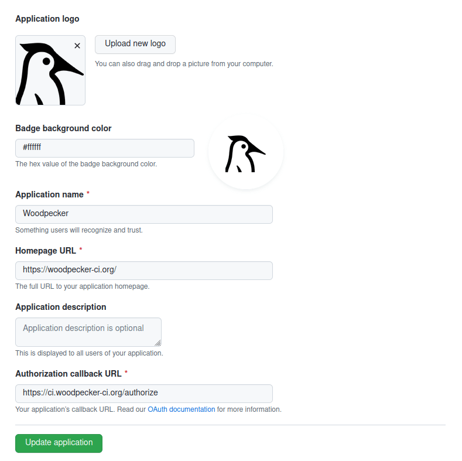

# GitHub

Woodpecker comes with built-in support for GitHub and GitHub Enterprise. To enable GitHub you should configure the Woodpecker server using the following environment variables:

```diff
# docker-compose.yml
version: '3'

services:
  woodpecker-server:
    [...]
    environment:
      - [...]
+     - WOODPECKER_GITHUB=true
+     - WOODPECKER_GITHUB_CLIENT=${WOODPECKER_GITHUB_CLIENT}
+     - WOODPECKER_GITHUB_SECRET=${WOODPECKER_GITHUB_SECRET}

  woodpecker-agent:
    [...]
```

## Registration

Register your application with GitHub to create your client id and secret. It is very important that the authorization callback URL matches your http(s) scheme and hostname exactly with `<scheme>://<host>/authorize` as the path.

Please use this screenshot for reference:



## Configuration

This is a full list of configuration options. Please note that many of these options use default configuration values that should work for the majority of installations.

### `WOODPECKER_GITHUB`

> Default: `false`

Enables the GitHub driver.

### `WOODPECKER_GITHUB_URL`

> Default: `https://github.com`

Configures the GitHub server address.

### `WOODPECKER_GITHUB_CLIENT`

> Default: empty

Configures the GitHub OAuth client id. This is used to authorize access.

### `WOODPECKER_GITHUB_CLIENT_FILE`

> Default: empty

Read the value for `WOODPECKER_GITHUB_CLIENT` from the specified filepath

### `WOODPECKER_GITHUB_SECRET`

> Default: empty

Configures the GitHub OAuth client secret. This is used to authorize access.

### `WOODPECKER_GITHUB_SECRET_FILE`

> Default: empty

Read the value for `WOODPECKER_GITHUB_SECRET` from the specified filepath

### `WOODPECKER_GITHUB_MERGE_REF`

> Default: `true`

TODO

### `WOODPECKER_GITHUB_SKIP_VERIFY`

> Default: `false`

Configure if SSL verification should be skipped.

### `WOODPECKER_GITHUB_RELEASE_ACTIONS`

> Default: `released, prereleased`

The actions to allow on release (trigger), comma seperated.
