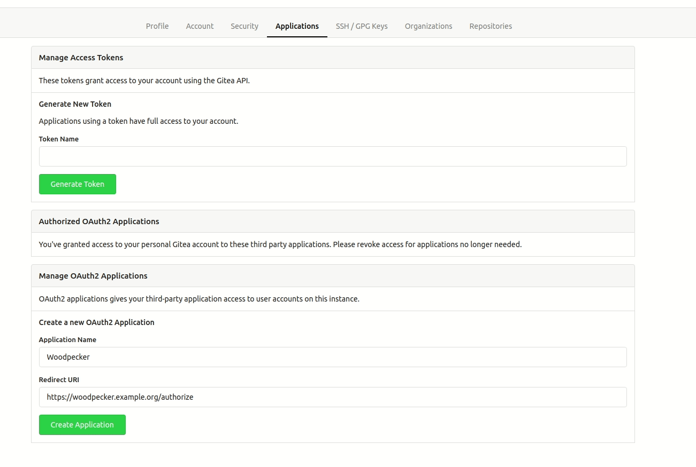

# Gitea

Woodpecker comes with built-in support for Gitea. To enable Gitea you should configure the Woodpecker container using the following environment variables:

```ini
WOODPECKER_GITEA=true
WOODPECKER_GITEA_URL=YOUR_GITEA_URL
WOODPECKER_GITEA_CLIENT=YOUR_GITEA_CLIENT
WOODPECKER_GITEA_SECRET=YOUR_GITEA_CLIENT_SECRET
```

## Gitea on the same host with containers

If you have Gitea also running on the same host within a container, make sure the agent does have access to it.
The agent tries to clone using the URL which Gitea reports through its API. For simplified connectivity, you should add the Woodpecker agent to the same docker network as Gitea is in.
Otherwise, the communication should go via the `docker0` gateway (usually 172.17.0.1).

To configure the Docker network if the network's name is `gitea`, configure it like this:

```diff title="docker-compose.yaml"
 services:
   [...]
   woodpecker-agent:
     [...]
     environment:
       - [...]
+      - WOODPECKER_BACKEND_DOCKER_NETWORK=gitea
```

## Registration

Register your application with Gitea to create your client id and secret. You can find the OAuth applications settings of Gitea at `https://gitea.<host>/user/settings/`. It is very import the authorization callback URL matches your http(s) scheme and hostname exactly with `https://<host>/authorize` as the path.

If you run the Woodpecker CI server on the same host as the Gitea instance, you might also need to allow local connections in Gitea, since version `v1.16`. Otherwise webhooks will fail. Add the following lines to your Gitea configuration (usually at `/etc/gitea/conf/app.ini`).

```ini
[webhook]
ALLOWED_HOST_LIST=external,loopback
```

For reference see [Configuration Cheat Sheet](https://docs.gitea.io/en-us/config-cheat-sheet/#webhook-webhook).



:::warning
Make sure your Gitea configuration allows requesting the API with a fixed page length of 50. The default value for the maximum page size is 50, but if you set a value lower than 50, some Woodpecker features will not work properly. Also see the [Configuration Cheat Sheet](https://docs.gitea.com/administration/config-cheat-sheet#api-api).
:::

## Configuration

This is a full list of configuration options. Please note that many of these options use default configuration values that should work for the majority of installations.

### `WOODPECKER_GITEA`

> Default: `false`

Enables the Gitea driver.

### `WOODPECKER_GITEA_URL`

> Default: `https://try.gitea.io`

Configures the Gitea server address.

### `WOODPECKER_GITEA_CLIENT`

> Default: empty

Configures the Gitea OAuth client id. This is used to authorize access.

### `WOODPECKER_GITEA_CLIENT_FILE`

> Default: empty

Read the value for `WOODPECKER_GITEA_CLIENT` from the specified filepath

### `WOODPECKER_GITEA_SECRET`

> Default: empty

Configures the Gitea OAuth client secret. This is used to authorize access.

### `WOODPECKER_GITEA_SECRET_FILE`

> Default: empty

Read the value for `WOODPECKER_GITEA_SECRET` from the specified filepath

### `WOODPECKER_GITEA_SKIP_VERIFY`

> Default: `false`

Configure if SSL verification should be skipped.
