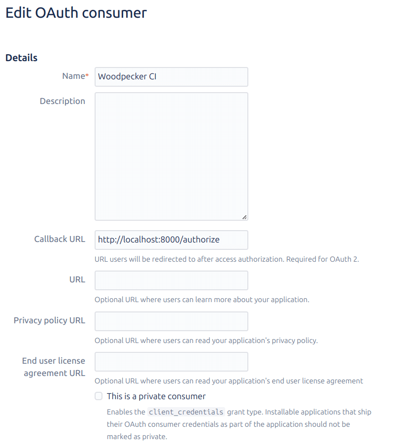
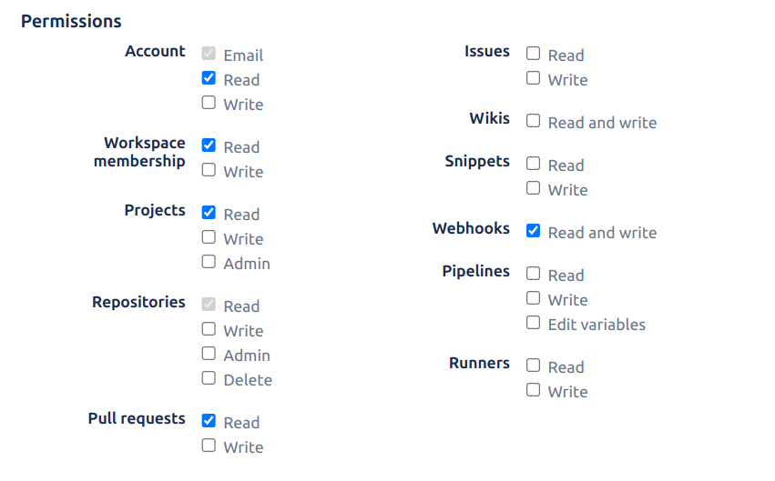

# Bitbucket

Woodpecker comes with built-in support for Bitbucket Cloud. To enable Bitbucket Cloud you should configure the Woodpecker container using the following environment variables:

```yaml title="docker-compose.yml"
version: '3'

services:
  woodpecker-server:
    [...]
    environment:
      - [...]
+     - WOODPECKER_BITBUCKET=true
+     - WOODPECKER_BITBUCKET_CLIENT=... # called "Key" in Bitbucket
+     - WOODPECKER_BITBUCKET_SECRET=...

  woodpecker-agent:
    [...]
```

## Registration

You must register an OAuth application at Bitbucket in order to get a key and secret combination for woodpecker. Navigate to your workspace settings and choose `OAuth consumers` from the menu, and finally click `Add Consumer` (the url should be like: `https://bitbucket.org/[your-project-name]/workspace/settings/api`).

Please set a name and set the `Callback URL` like this:

```nohighlight
https://<your-woodpecker-address>/authorize
```



Please also be sure to check the following permissions:

```nohighlight
Account: Email, Read
Workspace membership: Read
Projects: Read
Repositories: Read
Pull requests: Read
Webhooks: Read and Write
```



## Configuration

This is a full list of configuration options. Please note that many of these options use default configuration values that should work for the majority of installations.

### `WOODPECKER_BITBUCKET`

> Default: `false`

Enables the Bitbucket driver.

### `WOODPECKER_BITBUCKET_CLIENT`

> Default: empty

Configures the Bitbucket OAuth client key. This is used to authorize access.

### `WOODPECKER_BITBUCKET_CLIENT_FILE`

> Default: empty

Read the value for `WOODPECKER_BITBUCKET_CLIENT` from the specified filepath

### `WOODPECKER_BITBUCKET_SECRET`

> Default: empty

Configures the Bitbucket OAuth client secret. This is used to authorize access.

### `WOODPECKER_BITBUCKET_SECRET_FILE`

> Default: empty

Read the value for `WOODPECKER_BITBUCKET_SECRET` from the specified filepath

## Missing Features

Merge requests are not currently supported. We are interested in patches to include this functionality.
If you are interested in contributing to Woodpecker and submitting a patch please **contact us** via [Discord](https://discord.gg/fcMQqSMXJy) or [Matrix](https://matrix.to/#/#WoodpeckerCI-Develop:obermui.de).
