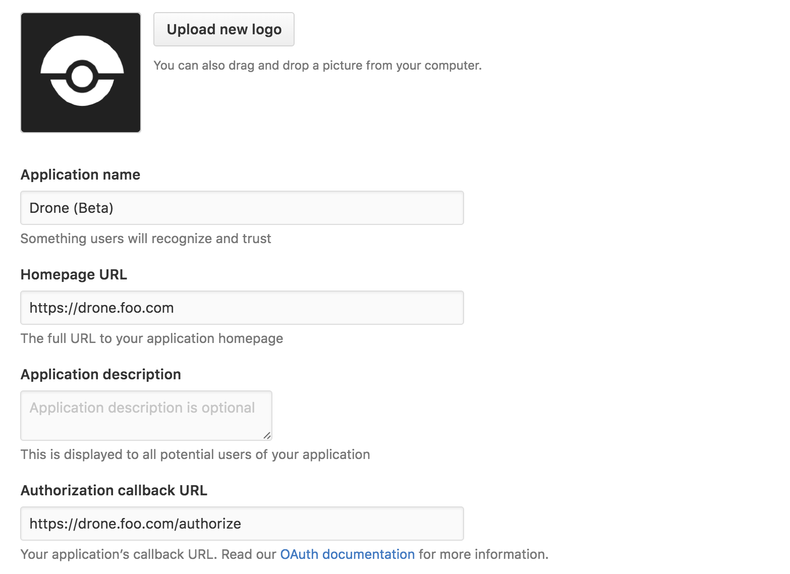

# GitHub

Woodpecker comes with built-in support for GitHub and GitHub Enterprise. To enable GitHub you should configure the Woodpecker server using the following environment variables:

```diff
# docker-compose.yml
version: '3'

services:
  woodpecker-server:
    [...]
    environment:
      - [...]
+     - WOODPECKER_GITHUB=true
+     - WOODPECKER_GITHUB_CLIENT=${WOODPECKER_GITHUB_CLIENT}
+     - WOODPECKER_GITHUB_SECRET=${WOODPECKER_GITHUB_SECRET}

  woodpecker-agent:
    [...]
```

## Registration

Register your application with GitHub to create your client id and secret. It is very import the authorization callback URL matches your http(s) scheme and hostname exactly with `<scheme>://<host>/authorize` as the path.

Please use this screenshot for reference:



## Configuration

This is a full list of configuration options. Please note that many of these options use default configuration values that should work for the majority of installations.

```shell
WOODPECKER_GITHUB=true # Set to true to enable the GitHub driver

WOODPECKER_GITHUB_URL=https://github.com # GitHub server address

WOODPECKER_GITHUB_CLIENT=... # GitHub oauth2 client id

WOODPECKER_GITHUB_SECRET=... # GitHub oauth2 client secret.

WOODPECKER_GITHUB_SCOPE=repo,repo:status,user:email,read:org # Comma-separated GitHub oauth scope.

WOODPECKER_GITHUB_GIT_USERNAME=... # Optional. Use a single machine account username to clone all repositories.

WOODPECKER_GITHUB_GIT_PASSWORD=... # Optional. Use a single machine account password to clone all repositories.

WOODPECKER_GITHUB_PRIVATE_MODE=false # Set to true if GitHub is running in private mode.

WOODPECKER_GITHUB_MERGE_REF=true # Set to true to use the `refs/pulls/%d/merge` vs `refs/pulls/%d/head`

WOODPECKER_GITHUB_CONTEXT=continuous-integration/woodpecker # Customize the GitHub status message context

WOODPECKER_GITHUB_SKIP_VERIFY=false # Set to true to disable SSL verification
```
