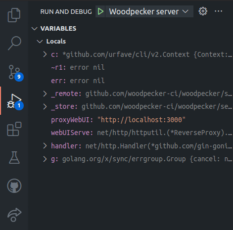

# Development

## Preparation

### Install Tools

#### Go

Install Golang (>=1.16) as described by [this guide](https://go.dev/doc/install).

#### make

> GNU Make is a tool which controls the generation of executables and other non-source files of a program from the program's source files. (https://www.gnu.org/software/make/)

Install make on:
  - Ubuntu: `apt install make` - [Docs](https://wiki.ubuntuusers.de/Makefile/)
  - [Windows](https://stackoverflow.com/a/32127632/8461267)
  - Mac OS: `brew install make`

#### Node.js & Yarn

Install [Node.js (>=14)](https://nodejs.org/en/download/) if you want to build Woodpeckers UI or documentation.

For dependencies installation (node_modules) for the UI and documentation of Woodpecker the package-manager Yarn is used. The installation of Yarn is described by [this guide](https://yarnpkg.com/getting-started/install).


### Create a `.env` file with your development configuration

Similar to the environment variables you can set for your production setup of Woodpecker, you can create a `.env` in the root of the Woodpecker project and add any need config to it.

A common config for debugging would look like this:

```ini
WOODPECKER_OPEN=true
WOODPECKER_ADMIN=your-username

# if you want to test webhooks with an online SCM like Github this address needs to be accessible from public server
WOODPECKER_HOST=http://your-dev-address.com/

# github (sample for a SCM config - see /docs/administration/vcs/overview for other SCMs)
WOODPECKER_GITHUB=true
WOODPECKER_GITHUB_CLIENT=<redacted>
WOODPECKER_GITHUB_SECRET=<redacted>

# agent
WOODPECKER_SERVER=localhost:9000
WOODPECKER_SECRET=a-long-and-secure-password-used-for-the-local-development-system
WOODPECKER_MAX_PROCS=1

# enable if you want to develop the UI
# WOODPECKER_DEV_WWW_PROXY=http://localhost:3000

# used so you can login without using a public address
WOODPECKER_DEV_OAUTH_HOST=http://localhost:8000

# disable health-checks while debugging (normally not needed while developing)
WOODPECKER_HEALTHCHECK=false

# WOODPECKER_LOG_LEVEL=debug
# WOODPECKER_LOG_LEVEL=trace
```

### O-Auth

Create an O-Auth app for your SCM as describe in the [SCM documentation](/docs/administration/vcs/overview). If you set `WOODPECKER_DEV_OAUTH_HOST=http://localhost:8000` you can use that address with the path as explained for the specific SCM to login without the need for a public address. For example for Github you would use `http://localhost:8000/authorize` as authorization callback URL.

## Developing with VS-Code

You can use different methods for debugging the Woodpecker applications. One of the currently recommend ways to debug and test the Woodpecker application is using [VS-Code](https://code.visualstudio.com/) or [VS-Codium](https://vscodium.com/) (Open-Source binaries of VS-Code) as most maintainers are using it and Woodpecker already includes the needed debug configurations for it.

As a starting guide for programming Go with VS-Code you can use this video guide:
[](https://www.youtube.com/watch?v=1MXIGYrMk80)

### Debugging Woodpecker

The Woodpecker source code already includes launch configurations for the Woodpecker server and agent. To start debugging you can click on the debug icon in the navigation bar of VS-Code (ctrl-shift-d). On that page you will see the existing launch jobs at the top. Simply select the agent or server and click on the play button. You can set breakpoints in the source files to stop at specific points.



## UI development

To develop the UI you need to install [Node.js and Yarn](#nodejs--yarn). In addition it is recommended to use VS-Code with the recommended plugin selection to get features like auto-formatting, linting and typechecking. The UI is written with [Vue 3](https://v3.vuejs.org/) as Single-Page-Application accessing the Woodpecker REST api.

The UI code is placed in `web/`. Change to that folder in your terminal with `cd web/` and install all dependencies by running `yarn install`. Start the UI locally with [hot-reloading](https://stackoverflow.com/a/41429055/8461267) by running: `yarn start`. To access the UI you now have to start the Woodpecker server.
For this you have to add the line `WOODPECKER_DEV_WWW_PROXY=http://localhost:3000` to your `.env` config and start the server after that as explained in the [debugging](#debugging) section.

The UI will now be served under [http://localhost:8000](http://localhost:8000) (don't access the UI from port 3000 as that only show the UI without access to the actual api).

### Tools and frameworks

The following list contains some tools and frameworks used by the Woodpecker UI. For some points we added some guidelines / hints to help you developing.

- [Vue 3](https://v3.vuejs.org/)
  - use `setup` and composition api
  - place (re-usable) components in `web/src/components/`
  - views should have a route in `web/src/router.ts` and are located in `web/src/views/`
- [Windicss](https://windicss.org/) (similar to Tailwind)
  - use Windicss classes where possible
  - if needed extend the Windicss config to use new classes
- [Vite](https://vitejs.dev/) (similar to Webpack)
- [Typescript](https://www.typescriptlang.org/)
  - avoid using `any` and `unknown` (the linter will prevent you from doing so anyways :wink:)
- [eslint](https://eslint.org/)
- [Volar & vue-tsc](https://github.com/johnsoncodehk/volar/) for type-checking in .vue file
  - use the take-over mode of Volar as described by [this guide](https://github.com/johnsoncodehk/volar/discussions/471)

## Documentation development

The documentation is using docusaurus as framework. You can learn more about it from its [official documentation](https://docusaurus.io/docs/).

If you only want to change some text it probably is enough if you just search for the corresponding [Markdown](https://www.markdownguide.org/basic-syntax/) file inside the `docs/docs/` folder and adjust it. If you want to change larger parts and test the rendered documentation you can run docusaurus locally. Similarly to the UI you need to install [Node.js and Yarn](#nodejs--yarn). After that you can run and build docusaurus locally by using the following commands:

```bash
cd docs/

yarn install

# build plugins used by the docs
yarn build:woodpecker-plugins

# start docs with hot-reloading, so you can change the docs and directly see the changes in the browser without reloading it manually
yarn start

# or build the docs to deploy it to some static page hosting
yarn build
```

## Testing & linting code

To test or lint parts of Woodpecker you can run one of the following commands:

```bash
# test server code
make test-server

# test agent code
make test-agent

# test cli code
make test-cli

# test datastore / database related code like migrations of the server
make test-server-datastore

# lint go code
make lint

# lint UI code
make lint-frontend

# test UI code
make test-frontend
```

If you want to test a specific go file you can also use:

```bash
go test -race -timeout 30s github.com/woodpecker-ci/woodpecker/<path-to-the-package-or-file-to-test>
```

Or you can open the test-file inside [VS-Code](#developing-with-vs-code) and run or debug the test by clicking on the inline commands:


## Package architecture of Woodpecker


## Run applications from terminal

If you want to run a Woodpecker applications from your terminal you can use one of the following commands from the base of the Woodpecker project. They will execute Woodpecker in a similar way as described in [debugging Woodpecker](#debugging-woodpecker) without the ability to really debug it in your editor.

```bash
# start server
$ go run ./cmd/server

# start agent
$ go run ./cmd/agent

# execute cli command
$ go run ./cmd/cli [command]
```

## Add new migration

Woodpecker uses migrations to change the database schema if a database model has been changed.

:::info
If you add a new property to a model, you dont have to do anything,
the column will be created based on the xorm tag automaticaly.
If you add a new model, you only have to add it to the `syncAll()` function at
`server/store/datastore/migration/migration.go` to get a table created.
:::

If a developer for example removes a property `Counter` from the model `Repo` in `server/model/` they would need to add a new migration task like the following  example to a file like `server/store/datastore/migration/004_repos_drop_repo_counter.go`:

```go
package migration

import (
	"xorm.io/xorm"
)

var alterTableReposDropCounter = task{
	name: "alter-table-drop-counter",
	fn: func(sess *xorm.Session) error {
		return dropTableColumns(sess, "repos", "repo_counter")
	},
}
```

:::warning
Do not `sess.Begin()`, `sess.Commit()` or `sess.Close()` the session, it is managed from outside.
:::

To automatically execute the migration after the start of the server, the new migration needs to be added to the end of `migrationTasks` in `server/store/datastore/migration/migration.go`.

:::tip
Woodpecker uses [Xorm](https://xorm.io/) as ORM for the database connection.
If you can find its documentation at [gobook.io/read/gitea.com/xorm](https://gobook.io/read/gitea.com/xorm/manual-en-US).
:::
