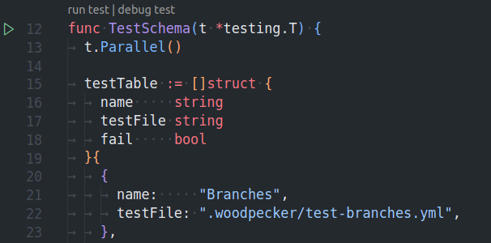

# Getting started

You can develop on your local computer by following the [steps below](#preparation-for-local-development) or you can start with a fully prepared online setup using [Gitpod](https://github.com/gitpod-io/gitpod) and [Gitea](https://github.com/go-gitea/gitea).

## Gitpod

If you want to start development or updating docs as easy as possible you can use our preconfigured setup for Woodpecker using [Gitpod](https://github.com/gitpod-io/gitpod). Gitpod starts a complete development setup in the cloud containing:

- An IDE in the browser or bridged to your local VS-Code or Jetbrains
- A preconfigured [Gitea](https://github.com/go-gitea/gitea) instance as forge
- A preconfigured Woodpecker server
- A single preconfigured Woodpecker agent node
- Our docs preview server

Simply start Woodpecker in Gitpod by clicking on the following badge. You can login with `woodpecker` and `password`.

[](https://gitpod.io/#https://github.com/woodpecker-ci/woodpecker)

## Preparation for local development

### Install Go

Install Golang (>=1.20) as described by [this guide](https://go.dev/doc/install).

### Install make

> GNU Make is a tool which controls the generation of executables and other non-source files of a program from the program's source files (<https://www.gnu.org/software/make/>).

Install make on:

- Ubuntu: `apt install make` - [Docs](https://wiki.ubuntuusers.de/Makefile/)
- [Windows](https://stackoverflow.com/a/32127632/8461267)
- Mac OS: `brew install make`

### Install Node.js & pnpm

Install [Node.js (>=14)](https://nodejs.org/en/download/) if you want to build Woodpeckers UI or documentation.

For dependencies installation (node_modules) for the UI and documentation of Woodpecker the package-manager pnpm is used. The installation of pnpm is described by [this guide](https://pnpm.io/installation).

### Create a `.env` file with your development configuration

Similar to the environment variables you can set for your production setup of Woodpecker, you can create a `.env` in the root of the Woodpecker project and add any need config to it.

A common config for debugging would look like this:

```ini title=".env"
WOODPECKER_OPEN=true
WOODPECKER_ADMIN=your-username

# if you want to test webhooks with an online forge like GitHub this address needs to be accessible from public server
WOODPECKER_HOST=http://your-dev-address.com

# github (sample for a forge config - see /docs/administration/forge/overview for other forges)
WOODPECKER_GITHUB=true
WOODPECKER_GITHUB_CLIENT=<redacted>
WOODPECKER_GITHUB_SECRET=<redacted>

# agent
WOODPECKER_SERVER=localhost:9000
WOODPECKER_SECRET=a-long-and-secure-password-used-for-the-local-development-system
WOODPECKER_MAX_WORKFLOWS=1

# enable if you want to develop the UI
# WOODPECKER_DEV_WWW_PROXY=http://localhost:8010

# used so you can login without using a public address
WOODPECKER_DEV_OAUTH_HOST=http://localhost:8000

# disable health-checks while debugging (normally not needed while developing)
WOODPECKER_HEALTHCHECK=false

# WOODPECKER_LOG_LEVEL=debug
# WOODPECKER_LOG_LEVEL=trace
```

### Setup O-Auth

Create an O-Auth app for your forge as describe in the [forges documentation](../30-administration/11-forges/10-overview.md). If you set `WOODPECKER_DEV_OAUTH_HOST=http://localhost:8000` you can use that address with the path as explained for the specific forge to login without the need for a public address. For example for GitHub you would use `http://localhost:8000/authorize` as authorization callback URL.

## Developing with VS-Code

You can use different methods for debugging the Woodpecker applications. One of the currently recommended ways to debug and test the Woodpecker application is using [VS-Code](https://code.visualstudio.com/) or [VS-Codium](https://vscodium.com/) (Open-Source binaries of VS-Code) as most maintainers are using it and Woodpecker already includes the needed debug configurations for it.

To launch all needed services for local development you can use "Woodpecker CI" debugging configuration that will launch UI, server and agent in debugging mode. Then open `http://localhost:8000` to access it.

As a starting guide for programming Go with VS-Code you can use this video guide:
[](https://www.youtube.com/watch?v=1MXIGYrMk80)

### Debugging Woodpecker

The Woodpecker source code already includes launch configurations for the Woodpecker server and agent. To start debugging you can click on the debug icon in the navigation bar of VS-Code (ctrl-shift-d). On that page you will see the existing launch jobs at the top. Simply select the agent or server and click on the play button. You can set breakpoints in the source files to stop at specific points.


## Testing & linting code

To test or lint parts of Woodpecker you can run one of the following commands:

```bash title="Test server code"
make test-server
```

```bash title="Test agent code"
make test-agent
```

```bash title="Test cli code"
make test-cli
```

```bash title="Test datastore / database related code like migrations of the server"
make test-server-datastore
```

```bash title="Lint go code"
make lint
```

```bash title="Lint UI code"
make lint-frontend
```

```bash title="Test UI code"
make test-frontend
```

If you want to test a specific go file you can also use:

```bash
go test -race -timeout 30s go.woodpecker-ci.org/woodpecker/<path-to-the-package-or-file-to-test>
```

Or you can open the test-file inside [VS-Code](#developing-with-vs-code) and run or debug the test by clicking on the inline commands:



## Run applications from terminal

If you want to run a Woodpecker applications from your terminal you can use one of the following commands from the base of the Woodpecker project. They will execute Woodpecker in a similar way as described in [debugging Woodpecker](#debugging-woodpecker) without the ability to really debug it in your editor.

```bash title="Start server"
go run ./cmd/server
```

```bash title="Start agent"
go run ./cmd/agent
```

```bash title="Execute cli command"
go run ./cmd/cli [command]
```
