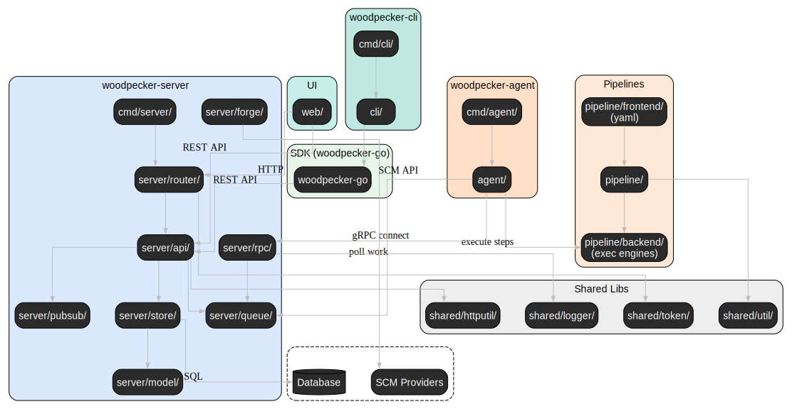

# Architecture

## Runtime Interactions

<!--
  If you want to update it, first look would be to get a simple svg of all module import graphs:
  `go run github.com/loov/goda@latest graph 'go.woodpecker-ci.org/woodpecker/v3/...' | dot -Tsvg -o graph.svg`

  generate a new png via:
  `dot -Tsvg woodpecker-architecture.dot -o woodpecker-architecture.svg`
-->

## System architecture

### main package hierarchy

| package            | meaning                                                        | imports                               |
| ------------------ | -------------------------------------------------------------- | ------------------------------------- |
| `cmd/**`           | parse command-line args & environment to stat server/cli/agent | all other                             |
| `agent/**`         | code only agent (remote worker) will need                      | `pipeline`, `rpc`, `shared`           |
| `cli/**`           | code only cli tool does need                                   | `pipeline`, `shared`, `woodpecker-go` |
| `server/**`        | code only server will need                                     | `pipeline`, `rpc`, `shared`           |
| `pipeline/**`      | core ci/cd engine from parsing to execution                    | `shared`                              |
| `rpc/**`           | RPC interface for agent-server communication                   | `pipeline`                            |
| `shared/**`        | code shared for all three main tools (go help utils)           | only std and external libs            |
| `woodpecker-go/**` | go client for server rest api                                  | std                                   |

### Server

| package              | meaning                                                                        | imports                                                                                                                                                                                      |
| -------------------- | ------------------------------------------------------------------------------ | -------------------------------------------------------------------------------------------------------------------------------------------------------------------------------------------- |
| `server/api/**`      | handle web requests from `server/router`                                       | `pipeline`, `rpc`, `../badges`, `../ccmenu`, `../logging`, `../model`, `../pubsub`, `../queue`, `../forge`, `../shared`, `../store`, `shared`, (TODO: mv `server/router/middleware/session`) |
| `server/badges/**`   | generate svg badges for pipelines                                              | `../model`                                                                                                                                                                                   |
| `server/ccmenu/**`   | generate xml ccmenu for pipelines                                              | `../model`                                                                                                                                                                                   |
| `server/rpc/**`      | gRPC server agents can connect to                                              | `rpc`, `../logging`, `../model`, `../pubsub`, `../queue`, `../forge`, `../pipeline`, `../store`                                                                                              |
| `server/logging/**`  | logging lib for gPRC server to stream logs while running                       | std                                                                                                                                                                                          |
| `server/model/**`    | structs for store (db) and api (json)                                          | std                                                                                                                                                                                          |
| `server/pipeline/**` | orchestrate pipelines (TODO: parts of it should move into /pipeline)           | `pipeline`, `../model`, `../pubsub`, `../queue`, `../forge`, `../store`, `../plugins`                                                                                                        |
| `server/pubsub/**`   | pubsub lib for server to push changes to the WebUI                             | std                                                                                                                                                                                          |
| `server/queue/**`    | queue lib for server where agents pull new pipelines from via gRPC             | `server/model`                                                                                                                                                                               |
| `server/forge/**`    | forge lib for server to connect and handle forge specific stuff                | `shared`, `server/model`                                                                                                                                                                     |
| `server/router/**`   | handle requests to REST API (and all middleware) and serve UI and WebUI config | `shared`, `../api`, `../model`, `../forge`, `../store`, `../web`                                                                                                                             |
| `server/store/**`    | handle database                                                                | `server/model`                                                                                                                                                                               |
| `server/web/**`      | server SPA                                                                     |                                                                                                                                                                                              |

- `../` = `server/`

### Agent

| package        | meaning                                              | imports                                                |
| -------------- | ---------------------------------------------------- | ------------------------------------------------------ |
| `agent/**`     | agent implementation that runs workflows             | `pipeline`, `rpc`, `shared`                            |
| `agent/rpc/**` | gRPC client for agent-server communication           | `rpc`, `pipeline/backend/types`, std and external libs |
| `cmd/agent/**` | CLI interface for starting and configuring the agent | `agent`, std and external libs                         |

The agent is a remote worker that connects to the server via gRPC to receive pipeline execution instructions and report back execution state and logs.
The agent polls the server's queue for new work, executes pipeline steps using the pipeline engine, and streams results back to the server.

TODO: Review cmd/agent/core to determine if any logic should be moved into the agent package for better separation of concerns.

### CLI

| package                  | meaning                                                                 | imports                                                                          |
| ------------------------ | ----------------------------------------------------------------------- | -------------------------------------------------------------------------------- |
| `cli/admin/**`           | admin commands for server management (users, secrets, registries, etc.) | `../common`, `../internal`, `woodpecker-go`                                      |
| `cli/common/**`          | shared utilities and helpers used across all CLI subcommands            | `../internal/config`, `../update`, `shared`                                      |
| `cli/context/**`         | manage multiple server contexts (connections to different servers)      | `../common`, `../internal/config`, `../output`                                   |
| `cli/exec/**`            | execute pipelines locally without server orchestration                  | `pipeline`, `../common`, `../lint`, `shared`                                     |
| `cli/info/**`            | display information about the current user                              | `../common`, `../internal`                                                       |
| `cli/internal/**`        | internal utilities for HTTP client, auth, and server communication      | `../internal/config`, `woodpecker-go`, `shared`                                  |
| `cli/internal/config/**` | configuration file management (load, store, credentials)                | std and external libs                                                            |
| `cli/lint/**`            | validate pipeline configuration files                                   | `pipeline/frontend/yaml`, `pipeline/frontend/yaml/linter`, `../common`, `shared` |
| `cli/org/**`             | manage organization-level resources (secrets, registries)               | `../common`, `../internal`, `woodpecker-go`                                      |
| `cli/output/**`          | formatting utilities for CLI output (tables, etc.)                      | std and external libs                                                            |
| `cli/pipeline/**`        | manage pipeline operations (start, stop, approve, logs, etc.)           | `../common`, `../internal`, `../output`, `woodpecker-go`, `shared`               |
| `cli/repo/**`            | manage repository-level resources (repos, crons, secrets, registries)   | `../common`, `../internal`, `../output`, `woodpecker-go`                         |
| `cli/setup/**`           | interactive first-time setup wizard for CLI configuration               | `../internal/config`                                                             |
| `cli/update/**`          | self-updater for the CLI binary                                         | std and external libs                                                            |
| `cmd/cli/**`             | CLI entry point and command structure                                   | `cli/**`                                                                         |

The CLI provides a command-line interface for interacting with Woodpecker servers.
Each subcommand is organized into its own package under `cli/<subcommand>/`.

The `cli/exec` subcommand allows local pipeline execution for testing and development by combining pipeline parsing and execution without requiring a running server or agent.

- `../` = `cli/`
