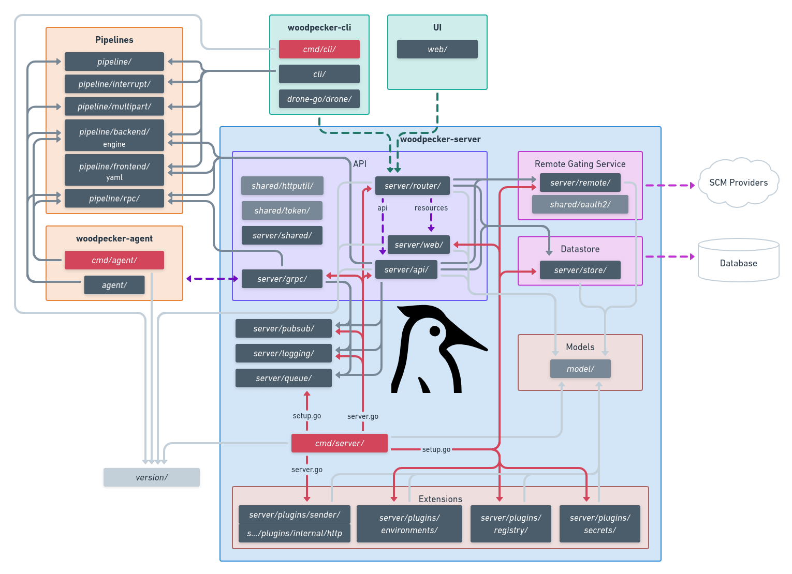

# Architecture

## Package architecture

## System architecture

### main package hirarchie

| package    | meaning                                                      | import
|------------|--------------------------------------------------------------|----------
| `cmd/**`   | parse commanline args & environment to stat server/cli/agent | all other
| `agent/**` | code only agent (remote worker) will need                    | `pipeline`, `shared`
| `cli/**`   | code only cli tool does need                                 | `pipeline`, `shared`, `woodpecker-go`
| `server/**`| code only server will need                                   | `pipeline`, `shared`
| `shared/**`| code shared for all three main tools (go help utils)         | only std and external libs
| `woodpecker-go/**` | go client for server rest api                        | std

### Server

| package             | meaning                                         | import
|---------------------|-------------------------------------------------|----------
| `server/api/**`     | handle web requests from `server/router`        | `pipeline`, `../badges`, `../ccmenue`, `../logging`, `../model`, `../pubsub`, `../queue`, `../remote`, `../shared`, `../store`, `shared`, (TODO: mv `server/router/middleware/session`)
| `server/badges/**`  | generate svg badges for pipelines               | `../model`
| `server/ccmenu/**`  | generate xml ccmenu for pipelines               | `../model`
| `server/grpc/**`    | gRPC server agents can connect to               | `pipeline/rpc/**`, `../logging`, `../model`, `../pubsub`, `../queue`, `../remote`, `../pipeline`, `../store`
| `server/logging/**` | logging lib for gPRC server to stream logs while running | std
| `server/model/**`   | structs for store (db) and api (json)           | std
| `server/plugins/**` | plugins for server                              | `../model`, `../remote`
| `server/pipeline/**`| orchistrate pipelines                          | `pipeline`, `../model`, `../pubsub`, `../queue`, `../remote`, `../store`, `../plugins`
| `server/pubsub/**`  | pubsub lib for server to push changes to the WebUI | std
| `server/queue/**`   | queue lib for server where agents pull new pipelines from via gRPC | `server/model`
| `server/remote/**`  | remote lib for server to connect and handle forge specific stuff | `shared`, `server/model`
| `server/router/**`  | handle REST API (and all middleware) and serve route `web` | `shared`, `../api`, `../model`, `../remote`, `../store`, `../web`
| `server/store/**`   | handle database                                 | `server/model`
| `server/shared/**`  | TODO: move and split [#974](https://github.com/woodpecker-ci/woodpecker/issues/974) |
| `server/web/**`     | server SPA                                      |

* `../` = `server/`

### Agent

TODO

### CLI

TODO
