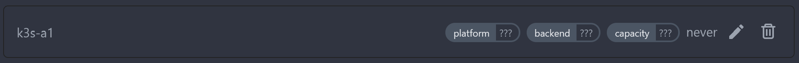

# Agent configuration

Agents are configured by the command line or environment variables. At the minimum you need the following information:

```diff
# docker-compose.yml
version: '3'

services:
  woodpecker-agent:
    [...]
    volumes:
      - woodpecker-agent-config:/etc/woodpecker
    environment:
+     - WOODPECKER_SERVER=localhost:9000
+     - WOODPECKER_AGENT_SECRET="your-shared-secret-goes-here"
```

The following are automatically set and can be overridden:

- WOODPECKER_HOSTNAME if not set, becomes the OS' hostname
- WOODPECKER_MAX_WORKFLOWS if not set, defaults to 1

## Processes per agent

By default the maximum processes that are run per agent is 1. If required you can add `WOODPECKER_MAX_WORKFLOWS` to increase your parallel processing on a per-agent basis.

```diff
# docker-compose.yml
version: '3'

services:
  woodpecker-agent:
  [...]
  environment:
    - WOODPECKER_SERVER=localhost:9000
    - WOODPECKER_AGENT_SECRET="your-shared-secret-goes-here"
+   - WOODPECKER_MAX_WORKFLOWS=4
```

## Agent registration on server

When the agent starts, it connects to the server using token from `WOODPECKER_AGENT_SECRET`. The server identifies agent and, if such agent doesn't exist, register him.
There are two types of token, so would be two ways of agent registration.

### Using system token

_System token_ is a token that is used system-wide, e. g. when you set the same token in `WOODPECKER_AGENT_SECRET` on both the server and the agents.

In that case registration process would be as follows:

1. First time Agent communicates with Server using system token;
2. Server registers Agent in DB, generates ID and sends this ID back to Agent;
3. Agent stores ID in a file configured by `WOODPECKER_AGENT_CONFIG_FILE`.

At the following startups Agent uses system token **and** ID.

### Using agent token

_Agent token_ is a token that is used by only particular agent. This unique token also configured by `WOODPECKER_AGENT_SECRET`, but only on the agent side.

In that case you probably doesn't configure `WOODPECKER_AGENT_SECRET` on the server side. The registration process would be as follows:

1. Administrator registers Agent manually in _Server settings - Agents - Add agent_;


2. The token generated in previous step have to be provided to Agent in `WOODPECKER_AGENT_SECRET`;
3. First time Agent communicates with Server using agent token;
4. Server identifies Agent by the token and fills additional information provided by Agent;


At following startups Agent uses own token only.

## All agent configuration options

Here is the full list of configuration options and their default variables.

### `WOODPECKER_SERVER`
>
> Default: `localhost:9000`

Configures gRPC address of the server.

### `WOODPECKER_USERNAME`
>
> Default: `x-oauth-basic`

The gRPC username.

### `WOODPECKER_AGENT_SECRET`
>
> Default: empty

A shared secret used by server and agents to authenticate communication. A secret can be generated by `openssl rand -hex 32`.

### `WOODPECKER_AGENT_SECRET_FILE`
>
> Default: empty

Read the value for `WOODPECKER_AGENT_SECRET` from the specified filepath, e.g. `/etc/woodpecker/agent-secret.conf`

### `WOODPECKER_LOG_LEVEL`
>
> Default: empty

Configures the logging level. Possible values are `trace`, `debug`, `info`, `warn`, `error`, `fatal`, `panic`, `disabled` and empty.

### `WOODPECKER_DEBUG_PRETTY`
>
> Default: `false`

Enable pretty-printed debug output.

### `WOODPECKER_DEBUG_NOCOLOR`
>
> Default: `true`

Disable colored debug output.

### `WOODPECKER_HOSTNAME`
>
> Default: empty

Configures the agent hostname.

### `WOODPECKER_AGENT_CONFIG_FILE`
>
> Default: `/etc/woodpecker/agent.conf`

Configures the path of the agent config file.

### `WOODPECKER_MAX_WORKFLOWS`
>
> Default: `1`

Configures the number of parallel workflows.

### `WOODPECKER_FILTER_LABELS`
>
> Default: empty

Configures labels to filter pipeline pick up. Use a list of key-value pairs like `key=value,second-key=*`. `*` can be used as a wildcard. By default agents provide three additional labels `platform=os/arch`, `hostname=my-agent` and `repo=*` which can be overwritten if needed. To learn how labels work check out the [pipeline syntax page](../20-usage/20-pipeline-syntax.md#labels).

### `WOODPECKER_HEALTHCHECK`
>
> Default: `true`

Enable healthcheck endpoint.

### `WOODPECKER_HEALTHCHECK_ADDR`
>
> Default: `:3000`

Configures healthcheck endpoint address.

### `WOODPECKER_KEEPALIVE_TIME`
>
> Default: empty

After a duration of this time of no activity, the agent pings the server to check if the transport is still alive.

### `WOODPECKER_KEEPALIVE_TIMEOUT`
>
> Default: `20s`

After pinging for a keepalive check, the agent waits for a duration of this time before closing the connection if no activity.

### `WOODPECKER_GRPC_SECURE`
>
> Default: `false`

Configures if the connection to `WOODPECKER_SERVER` should be made using a secure transport.

### `WOODPECKER_GRPC_VERIFY`
>
> Default: `true`

Configures if the gRPC server certificate should be verified, only valid when `WOODPECKER_GRPC_SECURE` is `true`.

### `WOODPECKER_BACKEND`
>
> Default: `auto-detect`

Configures the backend engine to run pipelines on. Possible values are `auto-detect`, `docker`, `local`, `ssh` or `kubernetes`.

### `WOODPECKER_BACKEND_DOCKER_*`

See [Docker backend configuration](./22-backends/10-docker.md#configuration)

### `WOODPECKER_BACKEND_SSH_*`

See [SSH backend configuration](./22-backends/30-ssh.md#configuration)

### `WOODPECKER_BACKEND_K8S_*`

See [Kubernetes backend configuration](./22-backends/40-kubernetes.md#configuration)

## Advanced Settings

:::warning
Only change these If you know what you do.
:::

### `WOODPECKER_CONNECT_RETRY_COUNT`

> Default: `5`

Configures number of times agent retries to connect to the server.

### `WOODPECKER_CONNECT_RETRY_DELAY`

> Default: `2s`

Configures delay between agent connection retries to the server.
