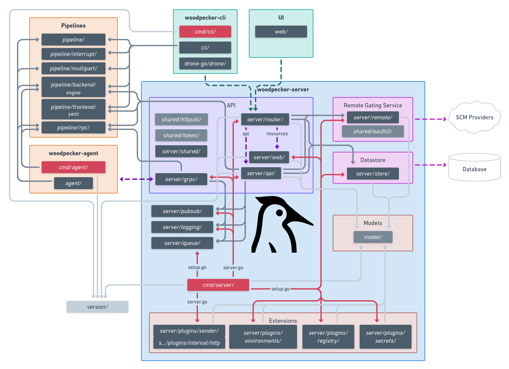

# Architecture

## Package architecture

## System architecture

### main package hierarchy

| package    | meaning                                                      | imports
|------------|--------------------------------------------------------------|----------
| `cmd/**`   | parse command-line args & environment to stat server/cli/agent | all other
| `agent/**` | code only agent (remote worker) will need                    | `pipeline`, `shared`
| `cli/**`   | code only cli tool does need                                 | `pipeline`, `shared`, `woodpecker-go`
| `server/**`| code only server will need                                   | `pipeline`, `shared`
| `shared/**`| code shared for all three main tools (go help utils)         | only std and external libs
| `woodpecker-go/**` | go client for server rest api                        | std

### Server

| package              | meaning                                                                             | imports
|----------------------|-------------------------------------------------------------------------------------|----------
| `server/api/**`      | handle web requests from `server/router`                                            | `pipeline`, `../badges`, `../ccmenue`, `../logging`, `../model`, `../pubsub`, `../queue`, `../forge`, `../shared`, `../store`, `shared`, (TODO: mv `server/router/middleware/session`)
| `server/badges/**`   | generate svg badges for pipelines                                                   | `../model`
| `server/ccmenu/**`   | generate xml ccmenu for pipelines                                                   | `../model`
| `server/grpc/**`     | gRPC server agents can connect to                                                   | `pipeline/rpc/**`, `../logging`, `../model`, `../pubsub`, `../queue`, `../forge`, `../pipeline`, `../store`
| `server/logging/**`  | logging lib for gPRC server to stream logs while running                            | std
| `server/model/**`    | structs for store (db) and api (json)                                               | std
| `server/plugins/**`  | plugins for server                                                                  | `../model`, `../forge`
| `server/pipeline/**` | orchestrate pipelines                                                               | `pipeline`, `../model`, `../pubsub`, `../queue`, `../forge`, `../store`, `../plugins`
| `server/pubsub/**`   | pubsub lib for server to push changes to the WebUI                                  | std
| `server/queue/**`    | queue lib for server where agents pull new pipelines from via gRPC                  | `server/model`
| `server/forge/**`    | forge lib for server to connect and handle forge specific stuff                     | `shared`, `server/model`
| `server/router/**`   | handle requests to REST API (and all middleware) and serve UI and WebUI config      | `shared`, `../api`, `../model`, `../forge`, `../store`, `../web`
| `server/store/**`    | handle database                                                                     | `server/model`
| `server/shared/**`   | TODO: move and split [#974](https://github.com/woodpecker-ci/woodpecker/issues/974) |
| `server/web/**`      | server SPA                                                                          |

- `../` = `server/`

### Agent

TODO

### CLI

TODO
