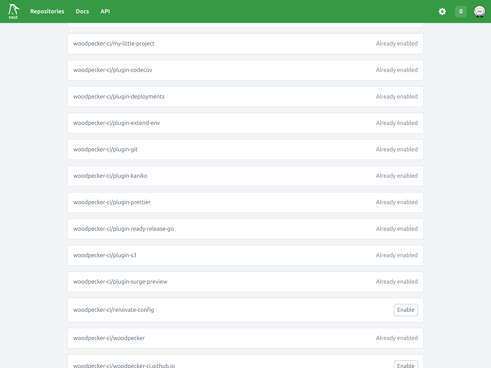
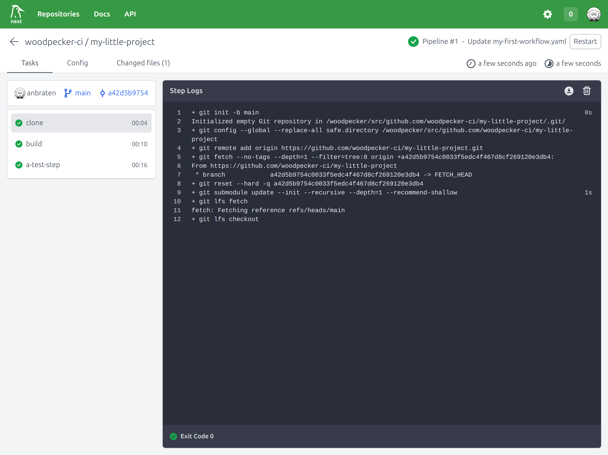

# Your first pipeline

Let's get started and create your first pipeline.

## 1. Repository Activation

To activate your repository in Woodpecker navigate to the repository list and `New repository`. You will see a list of repositories from your forge (GitHub, Gitlab, ...) which can be activated with a simple click.



To enable a repository in Woodpecker you must have `Admin` rights on that repository, so that Woodpecker can add something
that is called a webhook (Woodpecker needs it to know about actions like pushes, pull requests, tags, etc.).

## 2. Define first workflow

After enabling a repository Woodpecker will listen for changes in your repository. When a change is detected, Woodpecker will check for a pipeline configuration. So let's create a file at `.woodpecker/my-first-workflow.yaml` inside your repository:

```yaml title=".woodpecker/my-first-workflow.yaml"
when:
  - event: push
    branch: main

steps:
  - name: build
    image: debian
    commands:
      - echo "This is the build step"
      - echo "binary-data-123" > executable
  - name: a-test-step
    image: golang:1.16
    commands:
      - echo "Testing ..."
      - ./executable
```

**So what did we do here?**

1. We defined your first workflow file `my-first-workflow.yaml`.
2. This workflow will be executed when a push event happens on the `main` branch,
   because we added a filter using the `when` section:

   ```diff
   + when:
   +   - event: push
   +     branch: main

   ...
   ```

3. We defined two steps: `build` and `a-test-step`

The steps are executed in the order they are defined, so `build` will be executed first and then `a-test-step`.

In the `build` step we use the `debian` image and build a "binary file" called `executable`.

In the `a-test-step` we use the `golang:1.16` image and run the `executable` file to test it.

You can use any image from registries like the [Docker Hub](https://hub.docker.com/search?type=image) you have access to:

```diff
 steps:
   - name: build
-    image: debian
+    image: mycompany/image-with-awscli
     commands:
       - aws help
```

## 3. Push the file and trigger first pipeline

If you push this file to your repository now, Woodpecker will already execute your first pipeline.

You can check the pipeline execution in the Woodpecker UI by navigating to the `Pipelines` section of your repository.



As you probably noticed, there is another step in called `clone` which is executed before your steps. This step clones your repository into a folder called `workspace` which is available throughout all steps.

This for example allows the first step to build your application using your source code and as the second step will receive
the same workspace it can use the previously built binary and test it.

## 4. Use a plugin for reusable tasks

Sometimes you have some tasks that you need to do in every project. For example, deploying to Kubernetes or sending a Slack message. Therefore you can use one of the [official and community plugins](/plugins) or simply [create your own](./51-plugins/20-creating-plugins.md).

If you want to get a Slack notification after your pipeline has finished, you can add a Slack plugin to your pipeline:

```yaml
---
- name: notify me on Slack
  image: plugins/slack
  settings:
    channel: developers
    username: woodpecker
    password:
      from_secret: slack_token
  when:
    status: [success, failure] # This will execute the step on success and failure
```

To configure a plugin you can use the `settings` section.

Sometime you need to provide secrets to the plugin. You can do this by using the `from_secret` key. The secret must be defined in the Woodpecker UI. You can find more information about secrets [here](./40-secrets.md).

Similar to the `when` section at the top of the file which is for the complete workflow, you can use the `when` section for each step to define when a step should be executed.

Learn more about [plugins](./51-plugins/51-overview.md).

As you now have a basic understanding of how to create a pipeline, you can dive deeper into the [workflow syntax](./20-workflow-syntax.md) and [plugins](./51-plugins/51-overview.md).
