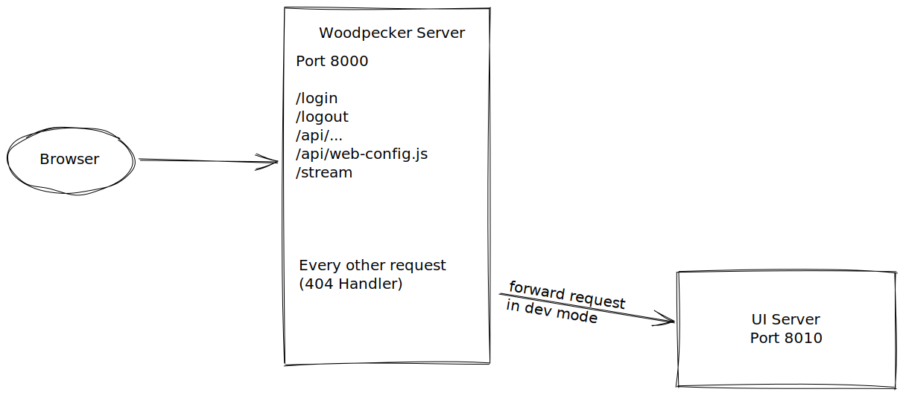

# UI Development

To develop the UI you need to install [Node.js and pnpm](./01-getting-started.md#install-nodejs--pnpm). In addition it is recommended to use VS-Code with the recommended plugin selection to get features like auto-formatting, linting and typechecking. The UI is written with [Vue 3](https://v3.vuejs.org/) as Single-Page-Application accessing the Woodpecker REST api.

## Setup

The UI code is placed in `web/`. Change to that folder in your terminal with `cd web/` and install all dependencies by running `pnpm install`. For production builds the generated UI code is integrated into the Woodpecker server by using [go-embed](https://pkg.go.dev/embed).

Testing UI changes would require us to rebuild the UI after each adjustment to the code by running `pnpm build` and restarting the Woodpecker server. To avoid this you can make use of the dev-proxy integrated into the Woodpecker server. This integrated dev-proxy will forward all none api request to a separate http-server which will only serve the UI files.

Start the UI server locally with [hot-reloading](https://stackoverflow.com/a/41429055/8461267) by running: `pnpm start`. To enable the forwarding of requests to the UI server you have to enable the dev-proxy inside the Woodpecker server by adding `WOODPECKER_DEV_WWW_PROXY=http://localhost:8010` to your `.env` file.
After starting the Woodpecker server as explained in the [debugging](./01-getting-started.md#debugging-woodpecker) section, you should now be able to access the UI under [http://localhost:8000](http://localhost:8000).

## Tools and frameworks

The following list contains some tools and frameworks used by the Woodpecker UI. For some points we added some guidelines / hints to help you developing.

- [Vue 3](https://v3.vuejs.org/)
  - use `setup` and composition api
  - place (re-usable) components in `web/src/components/`
  - views should have a route in `web/src/router.ts` and are located in `web/src/views/`
- [Windicss](https://windicss.org/) (similar to Tailwind)
  - use Windicss classes where possible
  - if needed extend the Windicss config to use new classes
- [Vite](https://vitejs.dev/) (similar to Webpack)
- [Typescript](https://www.typescriptlang.org/)
  - avoid using `any` and `unknown` (the linter will prevent you from doing so anyways :wink:)
- [eslint](https://eslint.org/)
- [Volar & vue-tsc](https://github.com/johnsoncodehk/volar/) for type-checking in .vue file
  - use the take-over mode of Volar as described by [this guide](https://github.com/johnsoncodehk/volar/discussions/471)

## Messages and Translations

Woodpecker uses [Vue I18n](https://vue-i18n.intlify.dev/) as translation library. New translations have to be added to `web/src/assets/locales/en.json`. The English source file will be automatically imported into [Weblate](https://translate.woodpecker-ci.org/) (the translation system used by Woodpecker) where all other languages will be translated by the community based on the English source.
You must not provide translations except English in PRs, otherwise weblate could put git into conflicts (when someone has translated in that language file and changes are not into main branch yet)

For more information about translations see [Translations](./08-translations.md).
