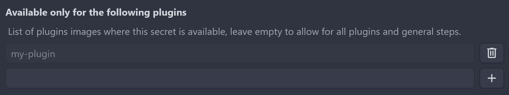

# Secrets

Woodpecker provides the ability to store named variables in a central secret store.
These secrets can be passed securely to individual pipeline steps using the `from_secret` keyword.

Three different levels of secrets are available.
The following list shows the priority of these.
If a secret is defined in multiple levels, the following precedence applies: Repository secrets > Organization secrets > Global secrets.

1. **Repository secrets**: Available to all pipelines of a repository.
1. **Organization secrets**: Available to all pipelines of an organization.
1. **Global secrets**: Can only be set by instance admins.
   Global secret are available to all pipelines of the **entire** Woodpecker instance and should therefore be used with caution.

:::tip
In addition to the native secret integration, external secret providers can be utilized by interacting with them directly within pipeline steps.
Access to these providers can be configured using Woodpecker secrets, enabling the retrieval of secrets from the respective external sources.
:::

:::warning
Woodpecker can mask secrets from its native secret store, but it cannot apply the same protection to external secrets. As a result, these external secrets may be exposed in the pipeline logs.
:::

## Usage

You can set a setting or environment value from Woodpecker secrets using the `from_secret` syntax.

The example below passes a secret called `secret_token` which will be stored in an environment variable named `TOKEN_ENV`:

```diff
 steps:
   - name: 'step name'
     image: registry/repo/image:tag
     commands:
+      - echo "The secret is $TOKEN_ENV"
+    environment:
+      TOKEN_ENV:
+        from_secret: secret_token
```

The same syntax can be used to pass secrets to (plugin) settings.
A secret named `secret_token` is assigned to the setting `TOKEN`, which will then be available in the plugin as environment variable `PLUGIN_TOKEN` (see [plugins](./51-plugins/20-creating-plugins.md#settings) for details).
`PLUGIN_TOKEN` is then internally consumed by the plugin itself and will be honored during execution.

```diff
 steps:
   - name: 'step name'
     image: registry/repo/image:tag
+    settings:
+      TOKEN:
+        from_secret: secret_token
```

### Note about parameter pre-processing

Please note that parameter expressions undergo pre-processing, meaning they are evaluated before the pipeline starts.
If secrets are to be used in expressions, they must be properly escaped (using `$$`) to ensure correct handling.

```diff
 steps:
   - name: docker
     image: docker
     commands:
-      - echo ${TOKEN_ENV}
+      - echo $${TOKEN_ENV}
     environment:
       TOKEN_ENV:
         from_secret: secret_token
```

### Use in Pull Requests events

By default, secrets are not exposed to pull requests.
However, you can change this behavior by creating the secret and enabling the `pull_request` event type.
This can be configured either through the UI or via the CLI, as demonstrated below.

:::warning
Be cautious when exposing secrets to pull requests.
If your repository is public and initiates pull request runs without requiring approval, your secrets may be at risk.
Malicious actors could potentially exploit this to expose or transmit your secrets to an external location.
:::

## Plugins filter

To prevent abusing your secrets from malicious usage, you can limit a secret to a list of plugins.
If enabled they are not available to any other plugin (steps without user-defined commands).
Plugins have the advantage that they cannot run arbitrary commands, hence they cannot be used to expose secrets (in contrast to arbitrary steps).

:::note
If you specify a tag, the filter will honor it.
However, if the same image appears multiple times in the list, the least privileged entry takes precedence.
For example, an image without a tag will permit all tags, even if another entry with a pinned tag is included.
:::



## Adding Secrets

Secrets can be added through the UI or via the CLI.

### CLI Examples

Create the secret using default settings.
The secret will be available to all images in your pipeline, and will be available to all `push`, `tag`, and `deployment` events (not `pull_request` events).

```bash
woodpecker-cli repo secret add \
  --repository octocat/hello-world \
  --name aws_access_key_id \
  --value <value>
```

Create the secret and limit it to a single image:

```diff
 woodpecker-cli secret add \
   --repository octocat/hello-world \
+  --image woodpeckerci/plugin-s3 \
   --name aws_access_key_id \
   --value <value>
```

Create the secrets and limit it to a set of images:

```diff
 woodpecker-cli repo secret add \
   --repository octocat/hello-world \
+  --image woodpeckerci/plugin-s3 \
+  --image woodpeckerci/plugin-docker-buildx \
   --name aws_access_key_id \
   --value <value>
```

Create the secret and enable it for multiple hook events:

```diff
 woodpecker-cli repo secret add \
   --repository octocat/hello-world \
   --image woodpeckerci/plugin-s3 \
+  --event pull_request \
+  --event push \
+  --event tag \
   --name aws_access_key_id \
   --value <value>
```

Secrets can be loaded from a file using the `@` syntax.
This method is recommended for loading secrets from a file, as it ensures that newlines are preserved (this is for example important for SSH keys).
Here’s an example:

```diff
 woodpecker-cli repo secret add \
   -repository octocat/hello-world \
   -name ssh_key \
+  -value @/root/ssh/id_rsa
```
