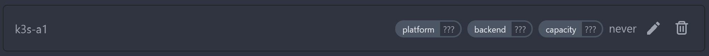

# Agent configuration

Agents are configured by the command line or environment variables. At the minimum you need the following information:

```ini
WOODPECKER_SERVER=localhost:9000
WOODPECKER_AGENT_SECRET="your-shared-secret-goes-here"
```

The following are automatically set and can be overridden:

- `WOODPECKER_HOSTNAME` if not set, becomes the OS' hostname
- `WOODPECKER_MAX_WORKFLOWS` if not set, defaults to 1

## Workflows per agent

By default, the maximum workflows that are executed in parallel on an agent is 1. If required, you can add `WOODPECKER_MAX_WORKFLOWS` to increase your parallel processing for an agent.

```ini
WOODPECKER_SERVER=localhost:9000
WOODPECKER_AGENT_SECRET="your-shared-secret-goes-here"
WOODPECKER_MAX_WORKFLOWS=4
```

## Agent registration

When the agent starts it connects to the server using the token from `WOODPECKER_AGENT_SECRET`. The server identifies the agent and registers the agent in its database if it wasn't connected before.

There are two types of tokens to connect an agent to the server:

### Using system token

A _system token_ is a token that is used system-wide, e.g. when you set the same token in `WOODPECKER_AGENT_SECRET` on both the server and the agents.

In that case registration process would be as following:

1. The first time the agent communicates with the server, it is using the system token
1. The server registers the agent in its database if not done before and generates a unique ID which is then sent back to the agent
1. The agent stores the received ID in a file (configured by `WOODPECKER_AGENT_CONFIG_FILE`)
1. At the following startups, the agent uses the system token **and** its received ID to identify itself to the server

### Using agent token

An _agent token_ is a token that is used by only one particular agent. This unique token is applied to the agent by `WOODPECKER_AGENT_SECRET`.

To get an _agent token_ you have to register the agent manually in the server using the UI:

1. The administrator registers a new agent manually at `Settings -> Agents -> Add agent`
   
   
1. The generated token from the previous step has to be provided to the agent using `WOODPECKER_AGENT_SECRET`
1. The agent will connect to the server using the provided token and will update its status in the UI:
   

## All agent configuration options

Here is the full list of configuration options and their default variables.

### `WOODPECKER_SERVER`

> Default: `localhost:9000`

Configures gRPC address of the server.

### `WOODPECKER_USERNAME`

> Default: `x-oauth-basic`

The gRPC username.

### `WOODPECKER_AGENT_SECRET`

> Default: empty

A shared secret used by server and agents to authenticate communication. A secret can be generated by `openssl rand -hex 32`.

### `WOODPECKER_AGENT_SECRET_FILE`

> Default: empty

Read the value for `WOODPECKER_AGENT_SECRET` from the specified filepath, e.g. `/etc/woodpecker/agent-secret.conf`

### `WOODPECKER_LOG_LEVEL`

> Default: empty

Configures the logging level. Possible values are `trace`, `debug`, `info`, `warn`, `error`, `fatal`, `panic`, `disabled` and empty.

### `WOODPECKER_DEBUG_PRETTY`

> Default: `false`

Enable pretty-printed debug output.

### `WOODPECKER_DEBUG_NOCOLOR`

> Default: `true`

Disable colored debug output.

### `WOODPECKER_HOSTNAME`

> Default: empty

Configures the agent hostname.

### `WOODPECKER_AGENT_CONFIG_FILE`

> Default: `/etc/woodpecker/agent.conf`

Configures the path of the agent config file.

### `WOODPECKER_MAX_WORKFLOWS`

> Default: `1`

Configures the number of parallel workflows.

### `WOODPECKER_AGENT_LABELS`

> Default: empty

Configures custom labels for the agent, to let workflows filter by it.
Use a list of key-value pairs like `key=value,second-key=*`. `*` can be used as a wildcard.
By default, agents provide three additional labels `platform=os/arch`, `hostname=my-agent` and `repo=*` which can be overwritten if needed.
To learn how labels work, check out the [pipeline syntax page](../20-usage/20-workflow-syntax.md#labels).

### `WOODPECKER_HEALTHCHECK`

> Default: `true`

Enable healthcheck endpoint.

### `WOODPECKER_HEALTHCHECK_ADDR`

> Default: `:3000`

Configures healthcheck endpoint address.

### `WOODPECKER_KEEPALIVE_TIME`

> Default: empty

After a duration of this time of no activity, the agent pings the server to check if the transport is still alive.

### `WOODPECKER_KEEPALIVE_TIMEOUT`

> Default: `20s`

After pinging for a keepalive check, the agent waits for a duration of this time before closing the connection if no activity.

### `WOODPECKER_GRPC_SECURE`

> Default: `false`

Configures if the connection to `WOODPECKER_SERVER` should be made using a secure transport.

### `WOODPECKER_GRPC_VERIFY`

> Default: `true`

Configures if the gRPC server certificate should be verified, only valid when `WOODPECKER_GRPC_SECURE` is `true`.

### `WOODPECKER_BACKEND`

> Default: `auto-detect`

Configures the backend engine to run pipelines on. Possible values are `auto-detect`, `docker`, `local` or `kubernetes`.

### `WOODPECKER_BACKEND_DOCKER_*`

See [Docker backend configuration](./22-backends/10-docker.md#configuration)

### `WOODPECKER_BACKEND_K8S_*`

See [Kubernetes backend configuration](./22-backends/40-kubernetes.md#configuration)

### `WOODPECKER_BACKEND_LOCAL_*`

See [Local backend configuration](./22-backends/20-local.md#options)

## Advanced Settings

:::warning
Only change these If you know what you do.
:::

### `WOODPECKER_CONNECT_RETRY_COUNT`

> Default: `5`

Configures number of times agent retries to connect to the server.

### `WOODPECKER_CONNECT_RETRY_DELAY`

> Default: `2s`

Configures delay between agent connection retries to the server.
